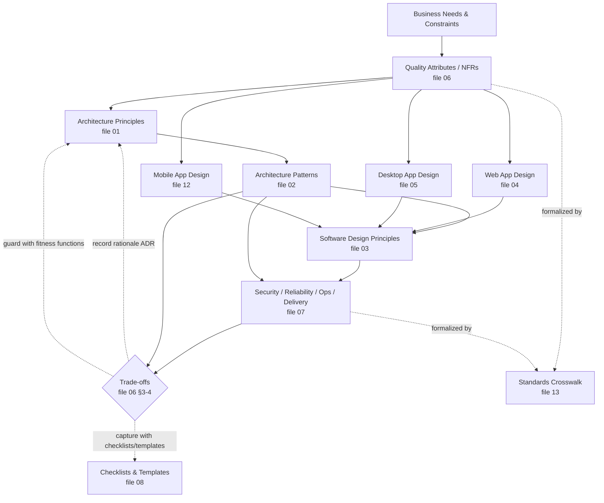

# Software & System Architecture and Design — Comprehensive Reference

A unified, technology-agnostic reference covering **system & software architecture principles**, **architecture patterns & trade-offs**, **general software design principles**, **web application design**, **desktop application design**, **cross-cutting quality attributes**, **security/reliability/operations/delivery**, and a library of **decision guides, checklists, and templates**.

Each principle, pattern, and practice is documented with a consistent structure — **summary, the problem it addresses, how it works (with diagrams/code where useful), benefits, costs/trade-offs, when to use, when not to use, decision criteria, common mistakes, related ideas, and sources** — so you can judge whether it fits a specific situation.

> **The unifying idea across every file:** *Manage complexity, make change cheap, expect failure, and align technical trade-offs with real business needs. Everything in architecture is a trade-off — choose consciously, record the rationale, and evolve as you learn.*

---

## How to Use This Reference

Start with the **decision you need to make**, not with a favorite pattern or technology.

A practical process:

1. Define the system context, users, business goals, constraints, and risks.
2. Identify **architecturally significant requirements** (quality attributes): availability, latency, security, compliance, modifiability, cost, deployment frequency, offline support, accessibility.
3. Read the relevant principle or pattern sections.
4. Compare benefits, costs, failure modes, and operational requirements.
5. Record the decision in an **Architecture Decision Record (ADR)** — see [`08`](08-checklists-and-templates.md#1-architecture-decision-record-template).
6. Define measurable **fitness functions** so the decision can be validated over time.
7. Revisit the decision when assumptions change.

### Reading paths

- **Designing a new system?** Start with [`06` — Quality Attributes & Trade-offs](06-quality-attributes-tradeoffs.md) (decide what matters), then [`01` — Architecture Principles](01-architecture-principles.md) and [`02` — Architecture Patterns](02-architecture-patterns.md), then [`03`](03-software-design-principles.md), and the surface-specific files [`04`](04-web-application-design.md)/[`05`](05-desktop-application-design.md). Capture decisions with [`08`](08-checklists-and-templates.md).
- **Building a web app?** See [`04`](04-web-application-design.md), with [`02`](02-architecture-patterns.md) for caching/queues/CQRS/resilience and [`07`](07-security-reliability-operations.md) for SLOs, observability, and delivery.
- **Building a desktop app?** See [`05`](05-desktop-application-design.md), with [`03`](03-software-design-principles.md) for modularity and [`07`](07-security-reliability-operations.md) for secure updates and telemetry.
- **Building a mobile app?** See [`12`](12-mobile-application-design.md), with [`05`](05-desktop-application-design.md) for shared MV*/offline-sync foundations and [`07`](07-security-reliability-operations.md) for supply chain and delivery.
- **Legacy modernization?** [`01`](01-architecture-principles.md) (evolutionary architecture, ADRs) + [`02`](02-architecture-patterns.md) (strangler fig, anti-corruption layer, modular monolith) + [`08`](08-checklists-and-templates.md) (modernization log).
- **Security/compliance review?** [`07`](07-security-reliability-operations.md) (SSDF, threat modeling, supply chain, named compliance frameworks) + [`04`](04-web-application-design.md) (web security) + [`05`](05-desktop-application-design.md)/[`12`](12-mobile-application-design.md) (desktop/mobile security) + [`08`](08-checklists-and-templates.md) checklists + [`13`](13-standards-crosswalk.md) (mapping to named standards/regulations).
- **Resolving a trade-off?** Use the [Decision Quick-Reference Matrix](#decision-quick-reference-matrix) below, then [`06`](06-quality-attributes-tradeoffs.md).
- **Building a game / real-time simulation?** See [`10`](10-game-architecture.md), with [`01`](01-architecture-principles.md)/[`02`](02-architecture-patterns.md) for general structural patterns and [`03`](03-software-design-principles.md) for composition-over-inheritance and code-level design. Working in the Godot engine specifically? [`11`](11-godot-engine-notes.md) maps [`10`](10-game-architecture.md)'s patterns onto it.

Every entry is self-contained, so you can also jump directly to any principle.

---

## The Files

| File | Scope | Read it when… |
|---|---|---|
| **[00 — Index](00-index.md)** | Navigation, glossary, decision matrices, the big picture, universal meta-principles | Orienting / finding the right section |
| **[01 — Architecture Principles](01-architecture-principles.md)** | What architecture is, reversibility, the architect's role, quality principles (SoC, modularity, coupling/cohesion, encapsulation, abstraction, evolution, Conway), data ownership, ADRs, C4, fitness functions, build/buy, managed services | Establishing architectural thinking and foundations |
| **[02 — Architecture Patterns & Trade-offs](02-architecture-patterns.md)** | Layering/structural patterns, distribution & deployment styles (monolith → microservices → serverless), communication/integration, data architecture, distributed-systems resilience, DDD, pattern combination guidance, anti-patterns | Choosing how to structure and distribute a system |
| **[03 — Software Design Principles](03-software-design-principles.md)** | SOLID, DRY/KISS/YAGNI & heuristics, coupling/cohesion/connascence, GRASP, design patterns (GoF + enterprise), code-level practices, error handling, testing, refactoring/tech debt, dev process | Writing and structuring code well |
| **[04 — Web Application Design](04-web-application-design.md)** | 12-Factor, frontend architecture & state, rendering strategies, Core Web Vitals/performance, accessibility, API design, security (OWASP Top 10:2025), authn/authz, data/persistence, scalability, reliability, observability, deployment, PWA/offline, privacy, DX | Building web applications specifically |
| **[05 — Desktop Application Design](05-desktop-application-design.md)** | What makes desktop different, UI patterns (MVC/MVP/MVVM/MVU), cross-platform vs native, frameworks compared (Electron/Tauri/Qt/Flutter/.NET), per-OS specifics, threading, offline-first & sync, OS integration, desktop security, performance, packaging/signing/auto-update, anti-patterns | Building desktop applications specifically |
| **[06 — Quality Attributes & Trade-offs](06-quality-attributes-tradeoffs.md)** | NFR catalog (the "-ilities"), trade-off theorems (CAP/PACELC, fallacies, scalability laws), Well-Architected pillars, ATAM & evaluation, decision frameworks, essential vs accidental complexity, a practical decision workflow | Deciding *what matters* and resolving trade-offs |
| **[07 — Security, Reliability, Operations & Delivery](07-security-reliability-operations.md)** | Secure SDLC/NIST SSDF, threat modeling, identity, supply chain, SLO/SLI/error budgets, observability, alerting, incident response, continuous delivery, trunk-based dev, feature flags, DB change management, cost, sustainability | Running software safely in production |
| **[08 — Checklists & Templates](08-checklists-and-templates.md)** | ADR template, review checklists, quality-attribute scenarios, technology selection rubric, readiness checklists, build-vs-buy template, pattern selection matrix, operational readiness review | Turning principles into concrete decisions |
| **[09 — References](09-references.md)** | Authoritative sources by category, with how each informed the guide; source-evaluation guidance | Verifying claims against primary sources |
| **[10 — Game Architecture](10-game-architecture.md)** | Sim/presentation separation, fixed-tick pipeline, command pattern for replay, determinism requirements, ECS vs node composition, state machines & AI decision architectures, data-driven content, procedural generation, save persistence/versioning, async-PvP & real-time netcode models, performance patterns, frame budgets, asset pipeline, game testing, game-specific quality attributes | Architecting a real-time or turn-based game/simulation |
| **[11 — Godot Engine Notes](11-godot-engine-notes.md)** | **Engine-specific, time-sensitive** (verified against Godot 4.7): scenes/nodes/signals, `_physics_process` & physics interpolation, custom Resources & mod security, entity-count scaling ladder (nodes → Servers → ECS addons), determinism caveats, high-level multiplayer, GDScript/C#/GDExtension selection | Applying [`10`](10-game-architecture.md)'s patterns in Godot specifically |
| **[12 — Mobile Application Design](12-mobile-application-design.md)** | What makes mobile different, UI patterns (MVVM/MVI/MVU), native vs cross-platform (Flutter/React Native/Kotlin Multiplatform/.NET MAUI), iOS/Android specifics, offline-first & sync, state/navigation/push, mobile security (OWASP MASVS/MASTG), performance, accessibility, packaging/signing/store release, mobile quality attributes | Building mobile applications specifically |
| **[13 — Standards Crosswalk](13-standards-crosswalk.md)** | Maps every major concept in this guide to the formal international standard(s) or regulation(s) that define it: ISO/IEC 25010/25012/5055 (quality), ISO/IEC/IEEE 42010/12207/15288 (architecture/life cycle), 29119 (testing), 27001/27034/CSF/SLSA/SBOM (security/supply chain), WCAG/EN 301 549/EAA (accessibility), GDPR/27701 (privacy), PCI-DSS/HIPAA/SOC 2/FedRAMP (compliance) | Mapping this guide's vocabulary onto a standard an auditor, RFP, or regulator names |

---

## Decision Quick-Reference Matrix

Jump to the right section based on the question you're trying to answer.

### Structuring & Distributing a System

| Question | Go to |
|---|---|
| Monolith, modular monolith, or microservices? | [02 §4 distribution styles](02-architecture-patterns.md#4-distribution--deployment-styles), [§4.9 decision summary](02-architecture-patterns.md#49-monolith-vs-microservices-decision-summary) |
| Should I use serverless/FaaS? | [02 §4.4](02-architecture-patterns.md#44-serverless--function-as-a-service-faas) |
| How should I layer the code (Hexagonal/Clean/Onion/Layered)? | [02 §3](02-architecture-patterns.md#3-layering--structural-patterns) |
| How should services communicate (REST/gRPC/GraphQL/messaging/events)? | [02 §5](02-architecture-patterns.md#5-communication--integration-patterns) |
| Orchestration or choreography? | [02 §5.7](02-architecture-patterns.md#57-orchestration-vs-choreography) |
| Cross-service transactions / reliable events? | [02 §5.8 Saga](02-architecture-patterns.md#58-saga-distributed-transactions), [§5.9 Outbox](02-architecture-patterns.md#59-transactional-outbox) |
| Database-per-service or shared DB? | [02 §6.1](02-architecture-patterns.md#61-database-per-service-vs-shared-database) |
| Do I need CQRS / Event Sourcing? | [02 §6.3–6.4](02-architecture-patterns.md#63-cqrs-command-query-responsibility-segregation) |
| Find service boundaries? | [02 §8 DDD / Bounded Contexts](02-architecture-patterns.md#8-domain-driven-design-ddd) |
| Make the system resilient? | [02 §7](02-architecture-patterns.md#7-distributed-systems-resilience-patterns) |
| Align architecture with teams? | [01 §2.7 Conway's Law](01-architecture-principles.md#27-conways-law--team-structure) |
| Record/visualize decisions? | [01 §9 ADRs/C4](01-architecture-principles.md#9-architecture-decision-tooling) |

### Designing & Writing Code

| Question | Go to |
|---|---|
| Apply SOLID? | [03 §1](03-software-design-principles.md#1-solid-principles) |
| DRY vs duplication / when to abstract? | [03 §2.1 DRY/DAMP/AHA](03-software-design-principles.md#21-dry-damp-and-the-cost-of-coupling) |
| Inheritance or composition? | [03 §2.6](03-software-design-principles.md#26-composition-over-inheritance) |
| Which design pattern fits? | [03 §5](03-software-design-principles.md#5-design-patterns-gof) |
| Handle errors? | [03 §8](03-software-design-principles.md#8-error-handling--robustness) |
| How much / what kind of testing? | [03 §9](03-software-design-principles.md#9-testing-principles) |
| Manage technical debt / code smells? | [03 §10](03-software-design-principles.md#10-refactoring-code-smells--technical-debt) |
| Branching / CI-CD / review strategy? | [03 §11](03-software-design-principles.md#11-development-process--collaboration), [07 §9–11](07-security-reliability-operations.md#9-continuous-delivery) |
| Internationalize / localize (i18n/l10n)? | [03 §12](03-software-design-principles.md#12-internationalization--localization-i18nl10n) |

### Building Web Applications

| Question | Go to |
|---|---|
| CSR vs SSR vs SSG vs ISR vs islands/edge? | [04 §3](04-web-application-design.md#3-rendering-strategies) |
| Make the frontend fast? | [04 §4](04-web-application-design.md#4-frontend-performance--core-web-vitals) |
| Manage frontend state? | [04 §2.2](04-web-application-design.md#22-state-management) |
| Design my API (REST/GraphQL/gRPC/webhooks)? | [04 §6](04-web-application-design.md#6-api-design) |
| Secure the app (OWASP)? | [04 §7](04-web-application-design.md#7-web-application-security) |
| Sessions vs JWT / OAuth / RBAC vs ABAC? | [04 §8](04-web-application-design.md#8-authentication--authorization) |
| SQL vs NoSQL / caching / N+1? | [04 §9](04-web-application-design.md#9-data--persistence) |
| Enforce data invariants (uniqueness, append-only, allowed values)? | [04 §9.6](04-web-application-design.md#96-enforce-invariants-in-the-datastore) |
| Offline / PWA? | [04 §11](04-web-application-design.md#11-progressive-web-apps--offline) |
| Deploy safely (blue-green/canary)? | [04 §14](04-web-application-design.md#14-deployment-strategies), [07 §9](07-security-reliability-operations.md#9-continuous-delivery) |
| Make it observable? | [04 §13](04-web-application-design.md#13-observability), [07 §6](07-security-reliability-operations.md#6-observability) |

### Building Desktop Applications

| Question | Go to |
|---|---|
| Native, cross-platform, or webview? | [05 §3](05-desktop-application-design.md#3-cross-platform-vs-native-the-core-decision) |
| Electron vs Tauri vs Qt vs Flutter vs .NET? | [05 §4](05-desktop-application-design.md#4-cross-platform-frameworks-compared) |
| Which UI pattern (MVC/MVP/MVVM/MVU)? | [05 §2](05-desktop-application-design.md#2-desktop-ui-architecture-patterns) |
| Windows / macOS / Linux conventions? | [05 §5](05-desktop-application-design.md#5-per-os-native-specifics) |
| Keep the UI responsive (threading)? | [05 §6.2](05-desktop-application-design.md#62-threading--the-ui-thread) |
| Offline-first / local data / sync conflicts? | [05 §7](05-desktop-application-design.md#7-offline-first--local-data) |
| OS integration (files/tray/notifications)? | [05 §8](05-desktop-application-design.md#8-os-integration) |
| Secure a desktop app (incl. Electron/Tauri)? | [05 §9](05-desktop-application-design.md#9-desktop-security) |
| Startup/memory/battery/resource use? | [05 §10](05-desktop-application-design.md#10-performance--resource-use) |
| Packaging, code signing, auto-update? | [05 §11](05-desktop-application-design.md#11-packaging-distribution--updates) |

### Building Mobile Applications

| Question | Go to |
|---|---|
| Native, cross-platform, or logic-shared (KMP)? | [12 §3](12-mobile-application-design.md#3-native-vs-cross-platform-the-core-decision) |
| Flutter vs React Native vs Kotlin Multiplatform vs MAUI? | [12 §4](12-mobile-application-design.md#4-cross-platform-frameworks-compared) |
| Which UI pattern (MVVM/MVI/MVU)? | [12 §2](12-mobile-application-design.md#2-mobile-ui-architecture-patterns) |
| iOS vs Android specifics? | [12 §5](12-mobile-application-design.md#5-platform-specifics-ios-vs-android) |
| Offline-first / local data / sync? | [12 §6](12-mobile-application-design.md#6-offline-first--local-data--sync) |
| Push notifications / deep links / background work? | [12 §7](12-mobile-application-design.md#7-state-navigation-deep-links--push) |
| Secure a mobile app (OWASP MASVS/MASTG)? | [12 §8](12-mobile-application-design.md#8-mobile-security) |
| Battery/cold-start/jank performance? | [12 §9](12-mobile-application-design.md#9-performance--resource-use) |
| App-store submission, signing, staged rollout? | [12 §11](12-mobile-application-design.md#11-packaging-signing-store-submission--release) |

### Building Games

| Question | Go to |
|---|---|
| How do I keep simulation reproducible/testable? | [10 §1](10-game-architecture.md#1-simulationpresentation-separation), [10 §2](10-game-architecture.md#2-fixed-tick-update-pipeline) |
| How do I support replay / deterministic multiplayer? | [10 §3](10-game-architecture.md#3-command-pattern-for-deterministic-replay), [10 §4](10-game-architecture.md#4-determinism-requirements) |
| What are the concrete determinism rules (RNG, ordering, floats)? | [10 §4](10-game-architecture.md#4-determinism-requirements) |
| ECS or scene-graph/node composition? | [10 §5](10-game-architecture.md#5-entity-modeling-ecs-vs-scene-graphnode-composition) |
| How do I model combat/AI/UI modes? | [10 §6](10-game-architecture.md#6-state-machines-for-game-logic) |
| Which AI architecture (BT/utility/GOAP/influence maps/MCTS)? | [10 §7](10-game-architecture.md#7-game-ai-decision-architectures) |
| How should content (items/skills/enemies) be authored? | [10 §8](10-game-architecture.md#8-data-driven-content-pipeline) |
| How do I structure procedural generation (seeds, validation)? | [10 §9](10-game-architecture.md#9-procedural-generation-architecture) |
| How do I make saves survive updates and crashes? | [10 §11](10-game-architecture.md#11-save-data-persistence--versioning) |
| Async/snapshot-based PvP architecture? | [10 §12](10-game-architecture.md#12-netcode-patterns-for-asynchronous--replay-based-multiplayer) |
| Live multiplayer: lockstep, rollback, prediction, or snapshots? | [10 §13](10-game-architecture.md#13-real-time-netcode-models) |
| Pooling / spatial partitioning / data locality — when? | [10 §14](10-game-architecture.md#14-performance-patterns-pooling-spatial-partitioning-data-locality) |
| How do I own the frame budget (hitches, mobile thermal)? | [10 §15](10-game-architecture.md#15-frame-budget--profiling-discipline) |
| Asset pipeline, memory budgets, streaming? | [10 §16](10-game-architecture.md#16-asset-pipeline--content-streaming) |
| How do I test a game automatically (golden replays, fuzzing)? | [10 §17](10-game-architecture.md#17-testing--verification-for-games) |
| What quality attributes does a game add? | [10 §18](10-game-architecture.md#18-game-specific-quality-attributes) |
| How does all this map onto Godot? | [11](11-godot-engine-notes.md) |

### Resolving Trade-offs & Operations

| Question | Go to |
|---|---|
| Which quality attribute should win? | [06 §2 catalog](06-quality-attributes-tradeoffs.md#2-the-quality-attributes-catalog), [§3 tensions](06-quality-attributes-tradeoffs.md#3-the-inevitability-of-trade-offs) |
| Consistency vs availability vs latency? | [06 §4.1–4.2 CAP/PACELC](06-quality-attributes-tradeoffs.md#41-cap-theorem) |
| Simple or complex solution? | [06 §7.3](06-quality-attributes-tradeoffs.md#73-when-to-choose-simpler-vs-more-complex) |
| Evaluate an architecture? | [06 §5 Pillars](06-quality-attributes-tradeoffs.md#5-well-architected-pillars), [§6 ATAM](06-quality-attributes-tradeoffs.md#6-architecture-evaluation-methods) |
| Define SLOs / error budgets? | [07 §5](07-security-reliability-operations.md#5-slos-slis-and-error-budgets) |
| Threat model / secure SDLC? | [07 §1–2](07-security-reliability-operations.md#1-secure-software-development-lifecycle-ssdf) |
| Control cost / sustainability? | [07 §14–15](07-security-reliability-operations.md#14-cost-optimization) |
| Which named standard/regulation applies (PCI/HIPAA/SOC2/GDPR/WCAG/ISO 27001…)? | [08 §18 triage](08-checklists-and-templates.md#18-standards-conformance-triage), [`13`](13-standards-crosswalk.md) |
| Map this guide's quality catalog to ISO/IEC 25010? | [06 §2](06-quality-attributes-tradeoffs.md#2-the-quality-attributes-catalog) |

---

## The Big Picture: How It All Connects

**Reading:** Business needs determine which *quality attributes* matter (06). Those drive *architecture principles* (01) and *patterns* (02), and the surface-specific practices for *web* (04), *desktop* (05), and *mobile* (12), realized through *design principles* in code (03), and *operated* safely (07). Every step involves *trade-offs* (06), which should be recorded (ADRs), guarded (fitness functions), and captured with reusable *checklists and templates* (08). Where a decision engages a named international standard or regulation, the *standards crosswalk* (13) maps this guide's vocabulary onto it.

---

## Core Principle Matrix

| Principle | Primary Benefit | Main Cost | Use When | Avoid When |
|---|---|---|---|---|
| Modularity | Change isolation | Boundary design overhead | The system must evolve over time | The product is a disposable prototype |
| Loose coupling | Independent change | More abstraction and contracts | Teams or modules change at different rates | Calls are purely local and stable |
| High cohesion | Easier reasoning | Requires thoughtful decomposition | Business capabilities are identifiable | Responsibilities are still unknown |
| Explicit trade-offs | Better decisions | Slower initial discussion | Multiple quality attributes conflict | The decision is reversible and cheap |
| Evolutionary architecture | Adaptability | Requires tests and feedback loops | Requirements are uncertain | Domain is fixed, highly regulated, low change |
| Secure by design | Risk reduction | More up-front discipline | Software handles sensitive data or users | Never avoid entirely; only scale rigor |
| Observability by design | Faster diagnosis | Instrumentation and storage cost | Production failures are costly | Never for production; only scale scope |
| Accessibility by default | Broader usability and compliance | Design and testing effort | Any human-facing UI exists | Never for public or employee software |
| Automation | Repeatability | Tooling investment | Work is repeated or risky | One-time low-risk manual work |
| Simplicity | Lower long-term cost | May delay advanced capabilities | Requirements can be met simply | Scale or compliance demands more structure |
| Safety by design | Prevents harm on fault | Fail-safe design cost, can reduce availability | Physical, financial, or life-safety consequences exist | Consequences of malfunction are purely cosmetic |

---

## Universal Meta-Principles (the throughline of every file)

1. **Everything is a trade-off.** No pattern is free; if you can't see the downside, look harder. *(06 §3)*
2. **Manage complexity.** Distinguish essential from accidental complexity; attack the accidental. *(06 §8, 03 §2.2)*
3. **Make change cheap.** Most cost is in maintenance; high internal quality speeds future change. *(01 §1.1, 03 §10)*
4. **Expect failure.** In distributed systems, something is always failing; design to absorb it. *(02 §7, 06 §4.3)*
5. **Earn complexity by demonstrated need.** Prefer simple (KISS/YAGNI); add complexity only when proven necessary — except where retrofitting is far costlier. *(03 §2.2–2.3, 06 §7.3)*
6. **Align with the business.** Architecture serves business needs, not technical fashion. *(01 §9.6)*
7. **Calibrate rigor to reversibility.** Decide reversible things fast; deliberate on irreversible ones. *(01 §1.2)*
8. **Loose coupling, high cohesion.** The most reliable predictor of maintainability. *(01 §2.3, 03 §3)*
9. **Own your data.** Data ownership is an architectural decision that drives consistency, coupling, and security. *(01 §8)*
10. **Record the why.** Decisions without rationale get blindly reversed. *(01 §9.1 ADRs)*
11. **Evolve.** All successful software changes; build for guided evolution. *(01 §2.6)*

---

## Glossary

| Term | Definition |
|---|---|
| **ACID** | Atomicity, Consistency, Isolation, Durability — transaction guarantees |
| **ADR** | Architecture Decision Record — documents a decision's context, choice, and consequences |
| **Aggregate** | DDD consistency boundary accessed via an aggregate root |
| **AHA** | "Avoid Hasty Abstractions" — prefer duplication until the right abstraction is clear |
| **Anti-Corruption Layer (ACL)** | Translation layer protecting a domain model from a foreign/legacy model |
| **ATAM** | Architecture Tradeoff Analysis Method |
| **Backpressure** | Mechanism for a slow consumer to signal a fast producer to slow down |
| **Behavior tree (BT)** | Hierarchical AI structure of selector/sequence/condition nodes; industry default for reactive character behavior ([10 §7](10-game-architecture.md#7-game-ai-decision-architectures)) |
| **BFF** | Backend-for-Frontend — a gateway tailored to a specific client type |
| **Bounded Context** | DDD boundary within which a model/language is consistent |
| **Bulkhead** | Resource isolation pattern limiting failure blast radius |
| **CALMS** | Culture, Automation, Lean, Measurement, Sharing — a DevOps model |
| **CAP** | Consistency, Availability, Partition tolerance — pick 2 under partition |
| **Cell / Stamp** | Independent deployment copy serving a subset of tenants/users/regions |
| **Circuit Breaker** | Pattern that fails fast when a dependency is unhealthy |
| **Code signing** | Cryptographically signing binaries/installers to prove authenticity & integrity (Authenticode/Developer ID) |
| **Cohesion** | How related a module's responsibilities are (higher is better) |
| **Connascence** | Fine-grained taxonomy of coupling (type, strength, degree, locality) |
| **Coupling** | Degree of interdependence between modules (looser is generally better) |
| **CQRS** | Command Query Responsibility Segregation — separate read/write models |
| **CRDT** | Conflict-free Replicated Data Type — data structure that merges without conflict |
| **CSR/SSR/SSG/ISR** | Client-Side / Server-Side Rendering, Static Generation, Incremental Static Regen |
| **DAMP** | Descriptive And Meaningful Phrases — readability over DRY in tests |
| **DDD** | Domain-Driven Design |
| **Dependency Injection (DI)** | Supplying dependencies from outside rather than constructing them internally |
| **Determinism (simulation)** | Same initial state + inputs + seed → bit-identical output on every run ([10 §4](10-game-architecture.md#4-determinism-requirements)) |
| **DORA metrics** | Deployment frequency, lead time, change failure rate, time to restore |
| **DRY** | Don't Repeat Yourself |
| **ECS** | Entity-Component-System — data-oriented game object model: entities are IDs, components are data, systems operate over component arrays ([10 §5](10-game-architecture.md#5-entity-modeling-ecs-vs-scene-graphnode-composition)) |
| **Electron** | Desktop framework bundling Chromium + Node.js; web UI, large footprint |
| **Error budget** | Allowed unreliability (1 − SLO), spent on releases/risk |
| **Event Sourcing** | Persisting state as an append-only sequence of events |
| **Fitness function** | Automated test that verifies an architectural characteristic |
| **FSM** | Finite State Machine — explicit states + legal transitions modeling mutually-exclusive modes ([10 §6](10-game-architecture.md#6-state-machines-for-game-logic)) |
| **GOAP** | Goal-Oriented Action Planning — AI plans an action sequence from goals + preconditions/effects at runtime ([10 §7](10-game-architecture.md#7-game-ai-decision-architectures)) |
| **Golden replay** | Recorded (seed + command log + state checksum) re-run in CI to detect unintended simulation changes ([10 §17](10-game-architecture.md#17-testing--verification-for-games)) |
| **GRASP** | General Responsibility Assignment Software Patterns |
| **HATEOAS** | Hypermedia As The Engine Of Application State (REST maturity Level 3) |
| **Hexagonal / Ports & Adapters** | Architecture isolating a domain core behind ports/adapters |
| **Idempotency** | Repeating an operation yields the same result as doing it once |
| **INP** | Interaction to Next Paint — Core Web Vital for responsiveness |
| **IPC** | Inter-Process Communication |
| **JWT** | JSON Web Token — signed, self-contained token of claims |
| **KISS** | Keep It Simple, Stupid |
| **LSP** | Liskov Substitution Principle |
| **LWW** | Last-Write-Wins — a simple (often lossy) conflict-resolution strategy |
| **MTTR / MTBF / MTTD** | Mean Time To Recovery / Between Failures / To Detect |
| **MVVM / MVP / MVU** | Presentation patterns: Model-View-ViewModel / -Presenter / -Update (unidirectional) |
| **N+1 problem** | One query per parent row instead of a batched/joined query |
| **Native vs cross-platform** | Per-OS codebases (fidelity) vs one codebase across OSes (reach) |
| **NFR** | Non-Functional Requirement (quality attribute) |
| **Notarization** | Apple's automated security check required for direct-download macOS apps |
| **OAuth2 / OIDC** | Authorization framework / authentication layer on top of it |
| **Offline-first** | Local machine is source of truth; network is an enhancement; sync when online |
| **OCP** | Open–Closed Principle |
| **Object pool** | Pre-allocated reusable instances replacing per-frame allocation/GC churn ([10 §14](10-game-architecture.md#14-performance-patterns-pooling-spatial-partitioning-data-locality)) |
| **OWASP** | Open Worldwide Application Security Project (Top 10 risks) |
| **PACELC** | Extension of CAP adding the latency-vs-consistency trade-off in normal operation |
| **PoEAA** | Patterns of Enterprise Application Architecture (Fowler) |
| **PKCE** | Proof Key for Code Exchange — secures OAuth Authorization Code flow |
| **PWA** | Progressive Web App |
| **RBAC / ABAC** | Role-Based / Attribute-Based Access Control |
| **RED / USE methods** | Rate-Errors-Duration (services) / Utilization-Saturation-Errors (resources) |
| **Repository** | Pattern mediating between domain and data mapping |
| **Rollback (netcode)** | Predict remote inputs, simulate immediately, re-simulate from confirmed state on misprediction — zero perceived input lag ([10 §13](10-game-architecture.md#13-real-time-netcode-models)) |
| **RTO / RPO** | Recovery Time / Point Objective |
| **Saga** | Distributed transaction via local steps + compensating actions |
| **Sandboxing** | OS-enforced restriction of an app's access (App Sandbox, AppContainer, Flatpak/Snap) |
| **SBOM** | Software Bill of Materials |
| **Service Mesh** | Infrastructure layer (sidecars) handling service-to-service concerns |
| **SLI / SLO / SLA** | Service Level Indicator / Objective / Agreement |
| **SoC** | Separation of Concerns |
| **SOLID** | SRP, OCP, LSP, ISP, DIP — five OO design principles |
| **Spatial partition** | Grid/tree structure mapping positions to entities, replacing O(n²) proximity scans ([10 §14](10-game-architecture.md#14-performance-patterns-pooling-spatial-partitioning-data-locality)) |
| **SPOF** | Single Point Of Failure |
| **SRP** | Single Responsibility Principle |
| **SSDF** | NIST Secure Software Development Framework |
| **Strangler Fig** | Incrementally replacing a legacy system route-by-route |
| **Tauri** | Desktop framework using the system webview + Rust; tiny footprint, capability-based security |
| **TDD / BDD** | Test-Driven / Behavior-Driven Development |
| **Technical debt** | Implied future cost of an expedient solution now |
| **Transactional Outbox** | Atomically write state + outbound message, then publish asynchronously |
| **Trunk-Based Development** | Frequent integration to main with short-lived branches |
| **Utility AI** | Score candidate actions from weighted, normalized considerations; pick the best ([10 §7](10-game-architecture.md#7-game-ai-decision-architectures)) |
| **WCAG / POUR** | Web Content Accessibility Guidelines / Perceivable-Operable-Understandable-Robust |
| **XDG Base Directory** | Linux/freedesktop spec for standard config/data/cache locations |
| **YAGNI** | You Aren't Gonna Need It |
| **Zero Trust** | "Never trust, always verify" — authenticate/authorize every request |

### Standards & Compliance Glossary (added alongside [`13`](13-standards-crosswalk.md))

| Term | Definition |
|---|---|
| **CLDR** | Unicode Common Locale Data Repository — locale data (formats, pluralization, collation) underlying i18n libraries |
| **CRA** | EU Cyber Resilience Act — security-by-design/SBOM/vuln-handling obligations for products with digital elements sold in the EU |
| **CycloneDX / SPDX** | The two dominant machine-readable **SBOM** formats (OWASP / Linux Foundation respectively) |
| **EAA** | European Accessibility Act — EU directive requiring accessibility for consumer products/services, deadlines from June 2025 |
| **EN 301 549** | The EU's harmonized ICT accessibility standard; incorporates WCAG and extends it to non-web ICT |
| **i18n / l10n** | Internationalization (design so software *can* adapt to locales) / Localization (adapting content for a specific locale) — [03 §12](03-software-design-principles.md#12-internationalization--localization-i18nl10n) |
| **ISO/IEC 25010** | The SQuaRE product quality model — 9 characteristics incl. Safety (2023); the standard behind this guide's quality-attribute catalog ([06 §2](06-quality-attributes-tradeoffs.md#2-the-quality-attributes-catalog)) |
| **ISO/IEC 5055** | CISQ Automated Source Code Quality Measures — ISO standard measuring Reliability/Performance Efficiency/Security/Maintainability directly from source code |
| **ISO/IEC/IEEE 42010** | The architecture-description standard: stakeholders → concerns → viewpoints → views ([01 §9.2b](01-architecture-principles.md#92b-the-formal-standard-behind-views-isoiecieee-42010)) |
| **LINDDUN** | A privacy-specific threat-modeling methodology (the privacy counterpart to STRIDE) |
| **MASVS / MASTG** | OWASP Mobile Application Security Verification Standard / Testing Guide ([12 §8](12-mobile-application-design.md#8-mobile-security)) |
| **NIST CSF** | NIST Cybersecurity Framework — Govern/Identify/Protect/Detect/Respond/Recover |
| **PIMS** | Privacy Information Management System — ISO/IEC 27701's certifiable extension of an ISMS |
| **SBOM** | Software Bill of Materials — see also **CycloneDX / SPDX** |
| **SLSA** | Supply-chain Levels for Software Artifacts — graduated build-provenance/integrity framework |
| **SQuaRE** | Systems and software Quality Requirements and Evaluation — the ISO/IEC 250xx series (25010/25012/25023/25040) |

---

## Standard Entry Format

Most principles and patterns in this reference use a consistent structure so you can scan and compare:

- **Summary** — one or two sentences.
- **Problem it addresses** — the force or pain that motivates it.
- **Description / How it works** — mechanics, with diagrams or code where useful.
- **Benefits** — what you gain.
- **Costs & trade-offs** — what you pay.
- **When to use** / **When not to use**.
- **Decision criteria** — the questions that decide it.
- **Common mistakes** / **warning signs**.
- **Related patterns** and **sources**.

> **The First Law of Software Architecture:** *Everything is a trade-off.* If you think you've found a choice that isn't, you simply haven't identified the trade-off yet. The architect's job is to make the trade-offs **conscious**, **measured**, and **recorded**.

---

*This reference is intentionally comprehensive and technology-agnostic. Treat every principle as a tool with a context — the value is in understanding the **reasoning** so you can judge when each applies. Specific quantitative figures (e.g., Core Web Vitals thresholds, availability "nines", framework binary sizes) reflect commonly published industry values and may evolve; verify against the current primary source ([`09`](09-references.md)) for production decisions. Where this guide's vocabulary needs to map onto a named international standard or regulation, see [`13`](13-standards-crosswalk.md) — standard editions and regulatory status also evolve and should be verified against the issuing body.*
