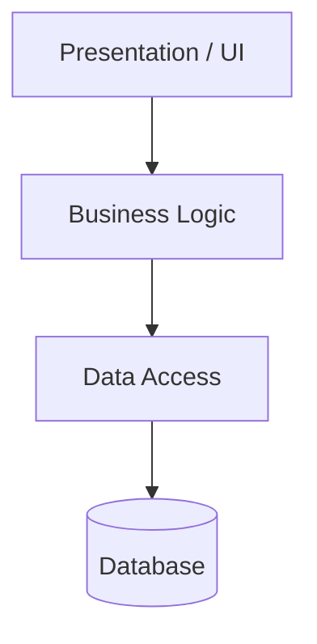

# System & Software Architecture Principles

Architecture is the set of important design decisions that shape a system's structure, behavior, risk, and ability to evolve. This file covers the **foundations** (what architecture is, reversibility, the architect's role), the **core quality principles** that guide every structural choice, and the **decision tooling** (ADRs, C4, fitness functions, build/buy) used to make and record those decisions.

For concrete *patterns* (layering, distribution, communication, data, resilience) see [`02`](02-architecture-patterns.md). For the quality attributes and trade-off theorems that drive decisions, see [`06`](06-quality-attributes-tradeoffs.md).

> **First Law of Software Architecture:** *Everything is a trade-off.* The architect's job is to make the trade-offs conscious, measured, and recorded.

---

## 1. Foundations

### 1.1 What Architecture Is

#### Summary
Software architecture is the set of design decisions that are *important* — costly to reverse, wide in impact, and constraining of future change. As Ralph Johnson put it (popularized by Martin Fowler): *"Architecture is about the important stuff. Whatever that is."*

#### Description
Architecture is the **shared understanding** that expert developers have of a system's design — the decisions you want to get right early because they are hard to change later. It is less about diagrams and more about decisions and their rationale.

A central economic insight: software has two kinds of quality.

- **External quality** — what users perceive (correct behavior, performance, usability).
- **Internal quality** — what developers perceive (clean structure, low coupling, good names). Internal quality is invisible to users but governs the **cost of change**.

The relationship is inverted from physical goods: **high internal quality leads to faster delivery, not slower.** Investing in clean structure pays off quickly because most of a system's cost is in ongoing modification, not initial construction. The accumulation of low internal quality is "cruft."

```
Cost of
change   │                          ╱ poor architecture (steep)
         │                       ╱
         │                    ╱
         │              ╱╌╌╌╌╌╌╌╌╌╌ good architecture (flatter)
         │        ╱╌╌╌
         │  ╱╌╌╌
         └─────────────────────────────► time / features added
```

#### Benefits
- Creates shared understanding and a defensible basis for decisions.
- Makes hidden costs visible.
- Keeps the cost of change low as the system grows.

#### Costs & trade-offs
- Identifying what is "important" takes judgment and time.
- Over-investment in structure for a throwaway prototype is waste.

#### Decision checklist
- Is this decision expensive to reverse or wide in impact? If so, treat it as architectural.
- Are we trading internal quality for short-term speed? Make that trade conscious and time-boxed.
- Do we have a shared understanding, or just diagrams?

#### Sources
Martin Fowler, *Software Architecture Guide*; *Who Needs an Architect?*

---

### 1.2 Architecturally Significant Decisions & Reversibility

#### Summary
Not all decisions are architectural. The ones that are tend to be **hard to reverse**, **wide in blast radius**, or **risk-changing**. Calibrate rigor to reversibility.

#### Description
A decision is *architecturally significant* when it is expensive to reverse, affects many teams, changes the risk profile, or constrains future design. Amazon's **"one-way vs two-way doors"** heuristic is a useful lens:

- **Two-way doors** (reversible): decide fast, learn from production.
- **One-way doors** (irreversible or very costly to reverse): deliberate carefully, prototype, write an ADR.

|  | **Low impact** | **High impact** |
|---|---|---|
| **Reversible (two-way door)** | Decide instantly; don't overthink | Decide quickly; monitor and adjust |
| **Irreversible (one-way door)** | Decide with light review | Deliberate; prototype; ADR; broad review |

#### Common mistakes
- Treating every minor decision as architectural (governance overhead).
- Treating an irreversible decision (data model, public API, hosting, security model) as casual.

#### Decision criteria
- How expensive is reversal? Who is affected? What failure mode are we accepting? How will we know if it was wrong?

#### Sources
Amazon shareholder letters (one-way/two-way doors); *Building Evolutionary Architectures*.

---

### 1.3 The Role of the Architect

#### Summary
The modern architect is a **partner and enabler**, not an ivory-tower decree-issuer. They move between strategy and implementation.

#### Description
Gregor Hohpe's **"Architect Elevator"** metaphor: the architect rides between the *penthouse* (business strategy) and the *engine room* (implementation), translating in both directions. Key responsibilities:

- Identify and frame architecturally significant decisions.
- Make quality attributes explicit and measurable.
- Guard architectural characteristics with fitness functions.
- Enable teams rather than gate them; spread context, not control.

#### Common mistakes
- Central architecture groups approving everything without local context.
- Architects who only draw diagrams and never touch code or production.

#### Sources
Gregor Hohpe, *The Software Architect Elevator*; *Building Evolutionary Architectures*.

---

## 2. Core Architectural Quality Principles

These are *forces*, not rules. They are applied in tension with one another.

### 2.1 Separation of Concerns (SoC)

#### Summary
Divide a system into distinct parts, each addressing a separate concern, so each can be understood and changed independently.

#### How it works


#### Benefits
- Easier reasoning, testing, and parallel development.
- Localized change: a UI change shouldn't ripple into persistence.

#### Costs & trade-offs
- Too much separation scatters a single feature across many files.
- Requires clear ownership and naming to avoid "where does this go?" confusion.

#### When to use / when to temper
Use whenever distinct concerns (validation, business rules, I/O, presentation) coexist. Temper when a feature is small and splitting it adds more navigation cost than clarity.

#### Related
Layered/Hexagonal/Clean architecture ([02 §3](02-architecture-patterns.md#3-layering--structural-patterns)); SRP ([03 §1.1](03-software-design-principles.md#11-single-responsibility-principle-srp)).

---

### 2.2 Modularity

#### Summary
Decompose a system into modules with hidden internals and explicit interfaces — the structural expression of Separation of Concerns.

#### Description
A good module is **deep** (John Ousterhout): a simple interface hiding substantial implementation. A **shallow** module (lots of interface, little behind it) adds cost without much benefit. Modules should align with **business capabilities or subdomains**, not just technical layers.

#### Benefits
- Change isolation, independent development and testing, replaceability.

#### Costs & trade-offs
- Boundary design requires domain understanding; premature modularization guesses wrong.
- Too many boundaries create overhead and indirection.

#### When not to use
Avoid speculative module systems before you have two or three concrete variations; prefer a well-factored single unit first.

#### Common mistakes
- Splitting by technical layer only and calling it domain modularity.
- Letting a "common"/"utils" module become a dumping ground.
- Creating circular dependencies between modules.

#### Sources
John Ousterhout, *A Philosophy of Software Design* (deep vs shallow modules).

---

### 2.3 Coupling & Cohesion

#### Summary
**Loose coupling, high cohesion** is the most reliable predictor of maintainability. Coupling is interdependence between modules; cohesion is how related a module's own responsibilities are.

#### Description
- **Coupling types (worst → best):** content → common → external → control → stamp → data → message.
- **Cohesion types (worst → best):** coincidental → logical → temporal → procedural → communicational → sequential → functional.

The goal is *low* coupling and *high* cohesion — code that changes together lives together, and modules know as little about each other as possible. Note that *zero* coupling means no system at all; the aim is the **right** coupling at the **right** strength and locality (see Connascence, [03 §3](03-software-design-principles.md#3-coupling-cohesion--connascence)).

#### Benefits
- Local reasoning, easier refactoring, less cross-team coordination, fewer ripple effects.

#### Decision checklist
- Does changing one module force changes in many others? (too much coupling)
- Does a module have one clear reason to change? (good cohesion)
- Can I convert a strong, distant coupling into a weak, local one?

---

### 2.4 Encapsulation & Information Hiding

#### Summary
Hide internal state and decisions behind a stable interface. *The interface is a promise; the implementation is a secret.*

#### Description
Parnas's principle: each module should conceal a **design decision likely to change**. Callers depend on *what* a module does, not *how*.

#### Costs & trade-offs
- Leaky abstractions expose internals and re-couple callers.
- Some data-oriented code benefits from transparent structures rather than getters/setters.

#### Common mistakes
- Getters/setters for every field (no real encapsulation).
- Public mutable state; leaking internal collections, DB models, or framework objects.

#### Sources
David Parnas, *On the Criteria To Be Used in Decomposing Systems into Modules*.

---

### 2.5 Abstraction

#### Summary
Capture essential detail and suppress the incidental — but discover abstractions; don't invent them prematurely.

#### Description
Good abstractions are **discovered** from two or three concrete cases, not guessed up front. Sandi Metz: *"The wrong abstraction is more costly than duplication."* Wait until variation is real (the "Rule of Three") before extracting.

#### When to avoid
Don't build a generic framework or plugin system before concrete variation exists; that creates coupling everyone must satisfy and no one fits well.

#### Related
YAGNI, DRY/DAMP/AHA ([03 §2](03-software-design-principles.md#2-core-design-heuristics)).

---

### 2.6 Design for Evolution (Evolutionary Architecture)

#### Summary
A good architecture **supports change**. Evolvability is often more valuable than theoretical elegance because most software lives longer than expected.

#### Description
Evolvability comes from modularity, tests, observability, clear contracts, data ownership, automated deployment, and decision records — *not* from abstraction everywhere. Protect likely change points while keeping the current design simple. **Fitness functions** ([§9.3](#93-architectural-fitness-functions)) guard chosen characteristics during change.

#### Costs & trade-offs
- Requires ongoing refactoring and architectural discipline in reviews.
- May require extra seams/interfaces at known variation points.

#### When not to use
Don't build speculative plugin systems or generic frameworks without concrete variation; don't over-abstract early prototypes.

#### Common mistakes
- Equating evolvability with microservices.
- Letting the database schema become the only integration contract.

#### Sources
Neal Ford, Rebecca Parsons, Patrick Kua, *Building Evolutionary Architectures*.

---

### 2.7 Conway's Law & Team Structure

#### Summary
*"Organizations design systems that mirror their own communication structure."* (Melvin Conway, 1968.) Team boundaries tend to become system boundaries.

#### Description
You can use this deliberately — the **Inverse Conway Maneuver** — by shaping teams around the architecture you want (e.g., aligning teams to business capabilities and deployable boundaries, per *Team Topologies*). But creating technical boundaries *only* because teams exist can preserve bad structure.

#### Benefits / costs
- **Benefit:** clear ownership, reduced coordination, faster delivery.
- **Cost:** reorganizing teams is disruptive; team autonomy can produce inconsistent technology choices; platform support may be needed to avoid duplication.

#### When not to use
- Don't split architecture around temporary project teams.
- Don't optimize for team autonomy if regulatory consistency matters more.

#### Sources
Melvin Conway; Skelton & Pais, *Team Topologies*; DORA "loosely coupled teams."

---

## 3. Prefer Cohesion Over Premature Reuse

#### Summary
Code that changes together should live together. Reuse is valuable only when it does not couple unrelated change.

#### Description
Premature reuse creates shared modules that many teams depend on, causing slow changes, hidden breakage, and generic abstractions that fit no one well. High cohesion means a module has one clear reason to change. Reuse should **emerge** from repeated concrete needs. Duplication is sometimes cheaper than coupling (see DRY vs DAMP, [03 §2.1](03-software-design-principles.md#21-dry-damp-and-the-cost-of-coupling)).

#### When not to use
- Don't casually duplicate security-critical or compliance-critical logic.
- Don't duplicate complex algorithms without a plan for keeping them consistent.

#### Common mistakes
- Creating shared libraries for two similar but diverging use cases.
- Confusing textual duplication with knowledge duplication.
- Moving code to a shared module before ownership is defined.

---

## 4. Choose the Simplest Architecture That Satisfies Known Constraints

#### Summary
Simplicity is a strategic advantage. **Complexity must pay rent.**

#### Description
Simple does not mean naive. A simple architecture is understandable, testable, observable, and adequate for current and near-term requirements. Complexity is justified only when it reduces a larger risk or enables a required capability. Teams frequently adopt distributed architectures, event streams, or generic platforms before the system needs them.

#### When to use / when not to use
- **Default** for most systems, new products with uncertain demand, small teams, internal tools.
- **Add structure** when hard requirements already demand stronger isolation, compliance, high availability, or independent scaling.

#### Common mistakes
- Mistaking simplicity for lack of engineering discipline.
- Ignoring *known* future constraints and building a throwaway foundation.
- Using future scale as an excuse for present complexity.

#### Sources
Google SRE (*Simplicity*); Fowler on internal quality; *The Twelve-Factor App*.

---

## 8. Treat Data Ownership as an Architectural Decision

#### Summary
Data ownership determines consistency, coupling, security, and team independence. Many architectures fail because the *code* is separated but the *data* remains shared.

#### Description
Each important data concept should have an **owner** responsible for its schema, invariants, lifecycle, access rules, and change communication. A shared database can be pragmatic inside a modular monolith, but it undermines independent microservices unless carefully constrained. Distributed ownership may require replication, events, or API composition, and the **consistency model must be explicit** (see CAP/PACELC, [06 §4](06-quality-attributes-tradeoffs.md#4-key-trade-off-theorems--models)).

#### Benefits
- Clear invariants, safer schema evolution, better security classification, easier auditability.

#### Costs & trade-offs
- Strong ownership makes cross-domain queries harder.
- Reporting needs can tempt teams into operational data coupling.

#### When not to use
Never *ignore* data ownership for production systems. The rigor can vary, but ownership should always exist.

#### Common mistakes
- Letting reporting/analytics drive operational data coupling.
- Allowing every service to read every table.
- Treating event streams as the source of truth without governance.
- Ignoring data retention and deletion (privacy risk).

#### Sources
microservices.io (database-per-service, shared database, CQRS, saga); Well-Architected frameworks.

> *(Section numbering jumps to align with the patterns file: structural and distribution patterns live in [`02`](02-architecture-patterns.md). Sections 5–7 of the original architecture material — layering, communication, data, resilience — are consolidated there.)*

---

## 9. Architecture Decision Tooling

### 9.1 Architecture Decision Records (ADRs)

#### Summary
Short, versioned documents that capture one decision: its context, the decision, alternatives considered, and consequences. Without them, teams forget *why* and repeat debates.

#### Description
An ADR is a focused document — not a design essay — stored near the code or architecture docs so it is discoverable. See the full template in [08 §1](08-checklists-and-templates.md#1-architecture-decision-record-template).

```
# ADR-NNN: <title>
## Status        Proposed | Accepted | Superseded | Deprecated
## Context       Problem, constraints, quality attributes affected, assumptions
## Decision      What we decided
## Alternatives  Options considered, with why accepted/rejected
## Consequences  Positive, negative, new risks, operational/security/cost impact
## Validation    Metrics, tests, or fitness functions that confirm it works
```

#### When to use
Significant technology choices, data ownership, security model, deployment/hosting, and **rejected options likely to be proposed again**.

#### Common mistakes
- Writing ADRs after the fact as political justification.
- Omitting alternatives.
- Not updating status when superseded.

#### Sources
adr.github.io; Michael Nygard, *Documenting Architecture Decisions*.

---

### 9.2 The C4 Model

#### Summary
Visualize architecture at four zoom levels so each audience gets the right view: **Context → Container → Component → Code**, plus deployment and dynamic diagrams.

#### Description
Different audiences need different views; one diagram cannot explain everything. The C4 model separates concerns: system context (who/what interacts), containers (deployable/runnable units), components (inside a container), and code (rarely drawn by hand). Supplementary deployment and dynamic diagrams show runtime topology and interactions.

#### Common mistakes
- No legend or scope.
- Mixing logical and physical deployment in one view.
- Omitting external actors and systems.
- Hand-maintaining detailed code diagrams that quickly go stale (generate them instead).

#### Sources
Simon Brown, *The C4 Model* (c4model.com).

---

### 9.3 Architectural Fitness Functions

#### Summary
Automated tests that verify an *architectural characteristic* — the core mechanism of evolutionary architecture.

#### Description
Examples: "no cyclic dependencies between modules," "the domain layer imports no framework code," "p99 latency < 200 ms under 10k RPS," "no service reads another service's database." Fitness functions turn architectural intent into something CI can enforce, so structure doesn't silently decay.

#### When to use
Whenever you have an architectural rule worth protecting over time (layering, latency budget, dependency direction, security boundary).

#### Sources
*Building Evolutionary Architectures*; tools such as ArchUnit and dependency linters.

---

### 9.4 Build vs Buy vs Open Source

#### Summary
*Build what differentiates you; buy or adopt the rest.* Distinguish your core differentiator from undifferentiated heavy lifting.

#### Description
Evaluate options against total cost of ownership, time-to-market, control, lock-in, security/compliance, integration, and exit path. (Full template in [08 §13](08-checklists-and-templates.md#13-build-vs-buy-vs-rent-decision-template).)

#### Decision criteria
- Is this capability differentiating or commodity?
- What is the smallest experiment that reduces uncertainty?
- What would make us reverse this decision, and what is the exit path?

---

### 9.5 Use Managed Services

#### Summary
Prefer managed/PaaS offerings (databases, identity, queues, object storage) over self-operated infrastructure unless operating it yourself is a differentiator.

#### Description
Managed services trade some control and portability for dramatically lower operational burden. *"Use an identity service rather than building your own"* is the canonical example — authentication is high-risk, commodity, and easy to get dangerously wrong.

#### Costs & trade-offs
- Vendor lock-in and reduced control; possible cost at scale.
- Mitigate with abstraction layers only where a real exit need exists (don't abstract speculatively).

---

### 9.6 Build for the Needs of the Business

#### Summary
Architecture serves business needs, not technical fashion. Drive decisions from requirements, not résumés.

#### Description
Translate business needs into measurable targets: define **RTO/RPO** for recovery, **SLAs/SLOs/SLIs** for reliability (see [07 §5](07-security-reliability-operations.md#5-slos-slis-and-error-budgets)), model the system around real domains, and plan for *realistic* growth rather than imagined hyperscale.

#### Decision criteria
- What does the business actually require (availability, latency, compliance, time-to-market, cost)?
- Are we optimizing for theoretical scale at the expense of present delivery risk?

---

## 10. Visualize Architecture at Multiple Levels (Summary)

One diagram cannot explain everything. Use the C4 levels ([§9.2](#92-the-c4-model)) plus deployment and dynamic views for security and reliability reviews, onboarding, and incident analysis. Keep diagrams scoped, legended, and — for fast-changing internals — generated automatically.

---

## Key Cross-References

- **Patterns** that realize these principles: [`02` — Architecture Patterns & Trade-offs](02-architecture-patterns.md).
- **Code-level** expression: [`03` — Software Design Principles](03-software-design-principles.md) (SOLID, GRASP, coupling/cohesion, patterns).
- **What to optimize for:** [`06` — Quality Attributes & Trade-offs](06-quality-attributes-tradeoffs.md) (NFRs, CAP/PACELC, Well-Architected, ATAM).
- **Operating it:** [`07` — Security, Reliability, Operations & Delivery](07-security-reliability-operations.md).
- **Capturing decisions:** [`08` — Checklists & Templates](08-checklists-and-templates.md).

> **The throughline:** Manage complexity, make change cheap, expect failure, and align with the business. Record the *why*; guard it with fitness functions; evolve.
