# Architecture Patterns & Trade-offs

Patterns are reusable responses to recurring forces. **They are not goals.** Choose a pattern because its problem statement matches your situation and because you can afford its consequences. This file covers structural/layering patterns, distribution & deployment styles, communication & integration, data architecture, distributed-systems resilience, Domain-Driven Design, and the anti-patterns to avoid.

For the *principles* behind these choices see [`01`](01-architecture-principles.md); for the *trade-off theorems* (CAP, PACELC, scalability laws) see [`06`](06-quality-attributes-tradeoffs.md).

---

## Pattern Selection Rules

1. **Start from the problem, not the pattern name.**
2. **Prefer local, modular solutions before distributed ones.**
3. **Check operational maturity** before adopting patterns that need monitoring, automation, and incident response.
4. **Consider data ownership and consistency early.**
5. **Combine patterns deliberately** — combinations multiply complexity.
6. **Define exit criteria.** A pattern that helped at one stage can become a liability later.

---

## 3. Layering & Structural Patterns

### 3.1 Layered (N-Tier) Architecture

#### Summary
Separate code into horizontal layers — typically Presentation → Business/Domain → Persistence/Data Access → Database.

#### How it works
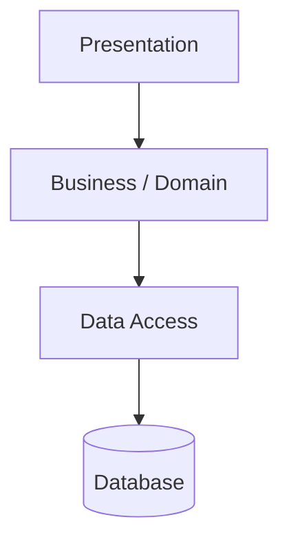
Layers may be **closed** (a layer may call only the one directly below) or **open** (may skip layers). A "layer of isolation" lets you change one layer without disturbing others.

#### Benefits
- Familiar and easy to teach; separates common technical concerns; good for CRUD and information systems; encourages testable domain logic.

#### Costs & trade-offs
- Layers can degrade into anemic pass-throughs (the **architecture sinkhole anti-pattern**).
- Cross-cutting features scatter across layers; strict layering adds boilerplate.
- Layering alone does **not** create business-capability boundaries.

#### When to use / when not to use
Use for clear UI/business/persistence apps and teams needing a simple structure. Avoid for high-performance paths where abstraction overhead matters, or highly domain-driven systems where vertical slices are clearer.

#### Common mistakes
- Putting business rules in controllers or database procedures.
- Letting one object serve as DTO, entity, and DB model everywhere.
- Creating layers because a framework generated them, not because they protect change.

---

### 3.2 Presentation–Domain–Data (PDD) Layering

#### Summary
Fowler's pragmatic three-layer split: **Presentation, Domain, Data Source.** A useful default for many information systems.

#### Warning
Beware the **anemic domain model** — a domain layer of data-only objects with all behavior in "service" classes, which loses the benefits of object-oriented domain modeling.

#### Sources
Martin Fowler, *PresentationDomainDataLayering*.

---

### 3.3 Hexagonal Architecture (Ports & Adapters)

#### Summary
Put domain/application logic at the center; connect all external systems through **ports** (interfaces) and **adapters** (implementations). Dependencies point **inward**.

#### How it works
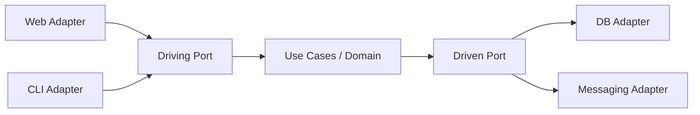
**Driving (primary)** adapters call the application (web, CLI, tests); **driven (secondary)** adapters are called by it (DB, messaging, third-party APIs).

#### Benefits
- Improves testability (fast domain tests with no external dependencies); makes infrastructure replaceable; keeps business rules independent of delivery mechanisms; good for long-lived domains.

#### Costs & trade-offs
- More interfaces and mapping code; can be over-engineered for simple CRUD; requires understanding dependency direction.

#### When to use
Business logic is valuable and long-lived; multiple adapters exist or are likely (REST, CLI, desktop UI, jobs, events); infrastructure may change.

#### Common mistakes
- Creating an interface for *every* class rather than meaningful ports.
- Letting adapter models leak into the core.
- Treating the database schema as the domain model.

#### Related
Dependency Inversion ([03 §1.5](03-software-design-principles.md#15-dependency-inversion-principle-dip)); Onion/Clean.

#### Sources
Alistair Cockburn, *Hexagonal Architecture*.

---

### 3.4 Onion Architecture

#### Summary
Concentric layers — Domain Model → Domain Services → Application Services → Infrastructure/UI/Tests — with dependencies pointing toward the center.

```
        ┌─────────────────────────────┐
        │  Infrastructure / UI / Tests │
        │   ┌─────────────────────┐    │
        │   │ Application Services │    │
        │   │  ┌───────────────┐   │    │
        │   │  │ Domain Services│  │    │
        │   │  │ ┌───────────┐ │   │    │
        │   │  │ │  Domain   │ │   │    │
        │   │  │ │   Model   │ │   │    │
        │   │  │ └───────────┘ │   │    │
        │   │  └───────────────┘   │    │
        │   └─────────────────────┘    │
        └─────────────────────────────┘
```
Same profile as Hexagonal; the difference is presentation (concentric rings vs symmetric ports/adapters).

#### Sources
Jeffrey Palermo, *The Onion Architecture*.

---

### 3.5 Clean Architecture

#### Summary
A synthesis of Hexagonal and Onion: concentric rings **Entities → Use Cases → Interface Adapters → Frameworks & Drivers**, governed by **The Dependency Rule** — source-code dependencies point only inward.

#### How it works
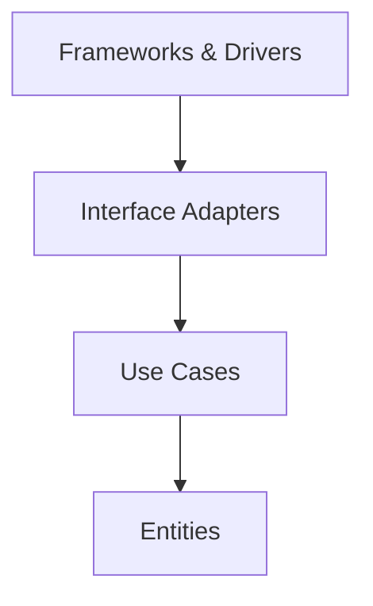
DTOs cross boundaries; inner layers know nothing of outer ones.

#### Benefits / costs
- **Benefit:** framework-independent, testable, UI/DB-replaceable business rules.
- **Cost:** more layers and mapping; over-engineering risk for simple apps.

#### Related
Dependency Inversion / SOLID; DDD.

#### Sources
Robert C. Martin, *Clean Architecture*.

---

### 3.6 Component-Based Architecture

#### Summary
Build from reusable, replaceable components with well-defined interfaces (e.g., React/Vue components, OSGi bundles, .NET assemblies).

#### Trade-offs
Strong reuse and replaceability, but versioning and interface stability become first-class concerns.

---

### 3.7 Modular Monolith

#### Summary
A single deployable application with **strong internal module boundaries** aligned to business capabilities. The recommended default for most new systems.

#### Description
One process and usually one deployment unit, but the codebase is divided into modules that communicate through explicit interfaces. Database access may be physically shared, but ownership and access rules are enforced by convention, code boundaries, or schema boundaries. Architecture tests (e.g., ArchUnit) prevent dependency violations.

#### Benefits
- Simpler deployment and debugging than microservices; low-latency internal calls; easier transactions; lower infrastructure/observability burden; a clean stepping stone toward services if boundaries are honest.

#### Costs & trade-offs
- Requires discipline to prevent boundary erosion; limited independent scaling and deployment; a build/runtime failure can affect the whole app.

#### When to use / when not to use
- **Use** for early/mid-stage products, small-to-medium teams, domains still being discovered, systems needing strong consistency, teams without mature platform/SRE support.
- **Avoid** for very large teams needing independent release trains, components with radically different scaling/availability needs, or regulatory boundaries requiring process/account isolation.

#### Common mistakes
- Calling a layered codebase "modular" when modules aren't domain-aligned.
- Allowing every module to access every table.
- A "common" module that becomes a dumping ground.
- No architecture tests to prevent dependency violations.

> **"Most of the value of microservices comes from modularity, which you can have without the distribution tax."** Start here.

---

## 4. Distribution & Deployment Styles

The most consequential architectural axis — how the system is split into deployable, runnable units.

### 4.1 Monolithic Architecture

#### Summary
A single build/deploy/process with a shared database. A valid — often optimal — default.

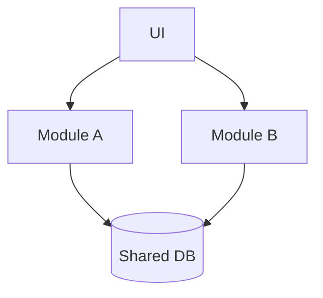

#### Benefits / costs
- **Benefit:** simplest to build, test, deploy, and reason about; strong consistency; low latency.
- **Cost:** can decay into a **big ball of mud** without internal discipline; scales as one unit; one team's change can block another.

#### Guidance
**MonolithFirst** (Fowler): start monolithic, extract services only when justified by proven, stable boundaries.

---

### 4.2 Microservices Architecture

#### Summary
An application built as a suite of small, independently deployable services, usually organized around **business capabilities**, each owning its data.

#### How it works
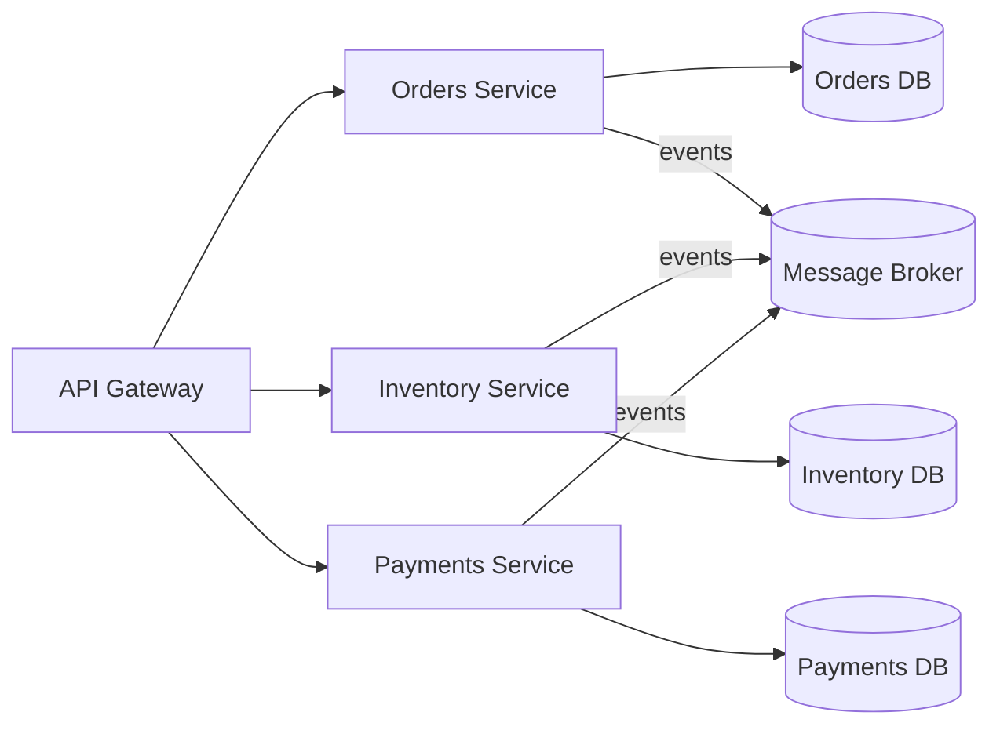

Characteristics (Fowler/Lewis): componentization via services; organized around business capabilities; products not projects; **smart endpoints & dumb pipes**; decentralized governance and data; infrastructure automation; design for failure; evolutionary design.

#### Benefits
- Independent deployment (when contracts are stable); team autonomy; isolated scaling; fault isolation if designed well; technology flexibility for specific needs.

#### Costs & trade-offs
- **Distributed-systems complexity:** latency, partial failure, retries, timeouts, network partitions.
- Harder data consistency; requires mature CI/CD, observability, incident response, service discovery, security, and platform automation.
- More expensive local development/testing; versioning and contract management overhead.

#### When to use / when not to use
- **Use** when multiple teams need autonomous delivery, capabilities are well understood, services have clear data ownership, operational maturity exists, and components have different scaling/reliability needs.
- **Avoid** for small teams, early domain discovery, strong cross-operation transactional consistency, or when the real problem is messy code rather than team/deployment scale.

#### Decision criteria
- Can each service own its data? Can the team operate production for its services? Are boundaries stable? Can you tolerate eventual consistency? Do you have contract testing and tracing?

#### Common mistakes
- **Distributed monolith:** services that must deploy together.
- Shared database across services; synchronous call chains for every request; no central observability; splitting by technical layer instead of business capability.

#### Related
API gateway/BFF ([§5.5](#55-api-gateway--backend-for-frontend-bff)); service discovery; circuit breakers/bulkheads ([§7](#7-distributed-systems-resilience-patterns)); saga ([§5.8](#58-saga-distributed-transactions)); database-per-service ([§6.1](#61-database-per-service-vs-shared-database)); DDD bounded contexts ([§8](#8-domain-driven-design-ddd)). Use the [Microservices Readiness Checklist](08-checklists-and-templates.md#5-microservices-readiness-checklist) before splitting.

---

### 4.3 Service-Oriented Architecture (SOA)

#### Summary
Reusable, network-exposed services, classically coordinated by an **Enterprise Service Bus (ESB)** with coarse-grained services and WS-*/SOAP.

#### Contrast
SOA tends toward "smart pipes" (logic in the ESB); microservices favor "**smart endpoints, dumb pipes**." SOA suits large enterprises with heavy integration needs; its centralized bus can become a bottleneck and coupling point.

---

### 4.4 Serverless / Function-as-a-Service (FaaS)

#### Summary
Ephemeral, event-triggered functions plus managed Backend-as-a-Service (BaaS); scale to zero; per-invocation billing.

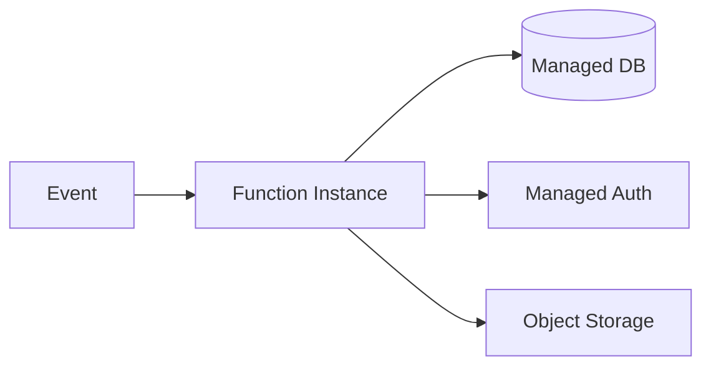

#### Benefits / costs
- **Benefit:** no server management; automatic scaling; pay only for use; great for spiky/unpredictable load.
- **Cost:** **cold starts**; vendor lock-in; execution time/memory limits; harder local testing and debugging; observability across many functions.

#### When to use / when not to use
- **Use** for event-driven workloads, spiky traffic, glue/automation, and teams that want minimal ops.
- **Avoid** for steady high-throughput workloads (cost), latency-critical paths sensitive to cold starts, or long-running processes.

#### Sources
Martin Fowler, *Serverless Architectures*.

---

### 4.5 Micro-Frontends

#### Summary
Apply the microservices idea to the frontend — independently built and deployed UI fragments composed into one app.

#### Integration techniques
Build-time packages, server-side composition, edge-side includes, iframes, or runtime JavaScript (Web Components / Module Federation).

#### Trade-offs
Team autonomy and independent deploys vs. duplicated dependencies, larger payloads, and consistency/UX challenges. Best when multiple teams own distinct UI areas of a large app.

#### Sources
Martin Fowler, *Micro Frontends*.

---

### 4.6 Space-Based Architecture

#### Summary
Eliminate the central-database bottleneck using an in-memory data grid ("tuple space") with asynchronous persistence. Suited to extreme, unpredictable concurrency (trading, ticketing, gaming).

---

### 4.7 Cell-Based / Deployment Stamps

#### Summary
Deploy multiple independent copies ("**cells**" or "**stamps**") of a workload, each serving a subset of tenants, users, or regions, to limit blast radius and scale by adding cells.

#### Benefits / costs
- **Benefit:** limits failure impact; supports regional/tenant isolation and data residency; repeatable scaling unit; simpler capacity planning per cell.
- **Cost:** more deployment orchestration; cross-cell data/routing complexity; configuration drift risk.

#### When to use / when not to use
- **Use** for SaaS platforms, multi-region systems, large user bases needing blast-radius control, or compliance/data-residency constraints.
- **Avoid** for small, low-traffic systems with low isolation needs.

#### Common mistakes
- A shared global dependency that re-introduces a single point of failure.
- No cell-evacuation or tenant-migration plan.
- Inconsistent configuration between stamps.

#### Sources
Azure *Deployment Stamps*; AWS cell-based architecture guidance.

---

### 4.8 Strangler Fig (Legacy Modernization)

#### Summary
Incrementally replace a legacy system by routing selected capabilities to a new implementation while the old system keeps running.

#### Description
Big-bang rewrites are risky and often fail because they delay value and underestimate hidden behavior. The strangler fig slices replacement by capability, user group, route, or workflow, enabling rollback by route control and learning from production traffic. Often paired with an **Anti-Corruption Layer** ([§8.5](#85-context-mapping--anti-corruption-layer-acl)).

#### When not to use
Legacy can't safely coexist; behavior isn't understood enough to slice; a small system can be replaced cheaply outright.

#### Common mistakes
- No end-state ownership plan; new system depends on legacy internals forever; migrating technical layers instead of business capabilities.

#### Sources
Martin Fowler, *Strangler Fig*; *Patterns of Legacy Displacement*.

---

### 4.9 Monolith vs Microservices Decision Summary

| Factor | Favors Monolith / Modular Monolith | Favors Microservices |
|---|---|---|
| Team size | Small to medium | Many autonomous teams |
| Domain maturity | Still being discovered | Well understood, stable boundaries |
| Scaling needs | Uniform | Divergent per component |
| Operational maturity | Limited platform/SRE support | Mature CI/CD, observability, on-call |
| Consistency needs | Strong cross-operation consistency | Tolerant of eventual consistency |
| Deployment independence | Acceptable to deploy together | Independent release trains required |
| Time-to-market | Fastest initially | Slower start, scales organizationally |

> **Rule of thumb:** Start with a **modular monolith**; extract services only across proven-stable boundaries when a concrete driver (team scale, divergent scaling, isolation) justifies the distribution tax.

---

## 5. Communication & Integration Patterns

### 5.1 Synchronous Request/Response (REST, RPC, gRPC, GraphQL)

#### Summary
Blocking request/response. Simple and immediate, but creates **temporal coupling** and risks cascading failures.

| Style | Best for | Strengths | Weaknesses |
|---|---|---|---|
| **REST** | Public APIs, resource CRUD | Ubiquitous, cacheable, simple | Over/under-fetching; many round trips |
| **gRPC** | Internal service-to-service | HTTP/2, Protobuf, fast, typed, streaming | Binary; needs gRPC-Web proxy in browsers |
| **GraphQL** | Diverse clients, flexible queries | Client-specified shape; strong schema | Caching harder; N+1 risk; query-cost control |

#### When to avoid
For workflows that don't need an immediate answer, prefer asynchronous messaging to decouple and absorb load.

---

### 5.2 Asynchronous Messaging (Queues)

#### Summary
Producers and consumers communicate through a queue (point-to-point), enabling load leveling, backpressure, and temporal decoupling.

#### Description
Typically **at-least-once** delivery → consumers must be **idempotent** ([§7.7](#77-idempotency)). Use dead-letter queues for poison messages.

#### Benefits / costs
- **Benefit:** decoupling; resilience to consumer outages; smooths bursts; independent scaling of workers.
- **Cost:** added infrastructure and latency; ordering, duplication, and visibility challenges.

---

### 5.3 Event-Driven Architecture (Pub/Sub & Event Streaming)

#### Summary
Components communicate by publishing and consuming **events** — immutable facts about something that happened (e.g., `OrderPlaced`).

#### How it works
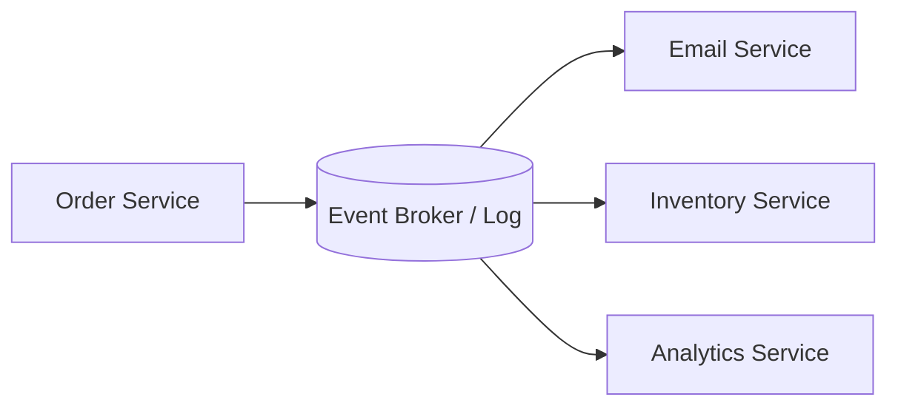

**Three interaction styles:** event *notification* (thin "it happened" signal); event-*carried state transfer* (event includes the data consumers need); event *sourcing* (events are the source of truth → [§6.4](#64-event-sourcing)).

#### Benefits / costs
- **Benefit:** decouples producers/consumers; supports async workflows; multiple consumers per fact; resilience and scalability; audit/integration enablement.
- **Cost:** harder debugging and reasoning; eventual consistency; schema versioning; duplicate delivery and ordering issues; observability must span async flows ("event spaghetti" risk).

#### When not to use
Immediate confirmed completion is required; the domain has no meaningful events; the team can't operate messaging infrastructure; events are RPC in disguise.

#### Common mistakes
- Vague events like `DataChanged`; assuming global ordering; ignoring idempotency; no dead-letter strategy; no schema-evolution policy.

#### Related
Choreography vs orchestration ([§5.7](#57-orchestration-vs-choreography)); Saga ([§5.8](#58-saga-distributed-transactions)); Outbox ([§5.9](#59-transactional-outbox)).

---

### 5.4 Streaming & Backpressure

#### Summary
Continuous data flow (reactive streams) where a slow consumer can signal a fast producer to slow down (**backpressure**). Used in real-time analytics, telemetry, and log/event pipelines.

---

### 5.5 API Gateway & Backend-for-Frontend (BFF)

#### Summary
A **gateway** is a single entry point handling routing, auth, rate limiting, TLS termination, aggregation, caching, and protocol translation. A **BFF** is a gateway tailored to one client type.

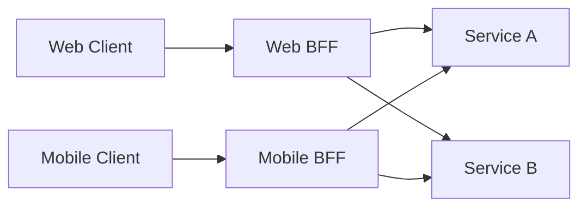

#### Benefits / costs
- **Benefit:** centralized cross-cutting controls; hides internal topology; client-specific optimization (BFF reduces over/under-fetching).
- **Cost:** can become a bottleneck/SPOF or a "god" component if business logic creeps in; possible duplication between BFFs.

#### Common mistakes
- Gateway/BFF holds business behavior; no versioning strategy; insufficient rate limiting/abuse protection; no shared auth standards across BFFs.

---

### 5.6 Service Mesh

#### Summary
A sidecar-based infrastructure layer (e.g., Envoy proxies) handling service-to-service concerns — mTLS, retries, timeouts, circuit breaking, load balancing, traffic shaping, and observability — outside application code.

#### Trade-offs
Consistent cross-cutting behavior and rich traffic control vs. operational complexity and added latency/resource cost. Justified at meaningful microservices scale.

---

### 5.7 Orchestration vs Choreography

#### Summary
**Orchestration** = a central coordinator directs steps (a conductor). **Choreography** = services react to events with no central brain (a dance).

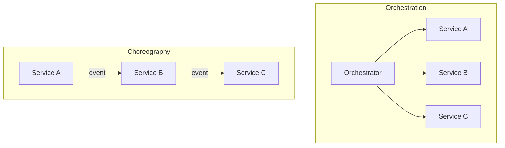

| Dimension | Orchestration | Choreography |
|---|---|---|
| Control | Centralized | Distributed |
| Visibility | Easy (one place) | Harder (spread across events) |
| Coupling | Coordinator couples to all | Looser |
| Change | Change the orchestrator | Change event contracts |
| Failure handling | Explicit, central | Emergent, per-service |
| Risk | Orchestrator becomes a god component | Hard to follow end-to-end flow |

Use orchestration when flows are complex and visibility matters; choreography when you want loose coupling and independent evolution.

---

### 5.8 Saga (Distributed Transactions)

#### Summary
Manage a business transaction spanning services as a **sequence of local transactions with compensating actions**, avoiding distributed two-phase commit (2PC).

#### How it works
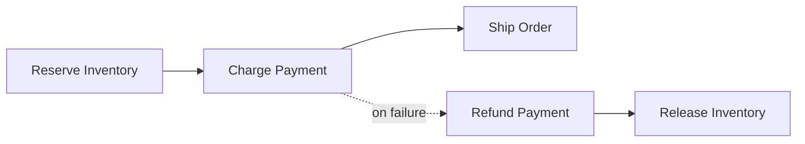
Implemented via orchestration (a saga coordinator) or choreography (events). Compensation is a **business action** (refund, apology email), not a technical rollback.

#### Benefits / costs
- **Benefit:** preserves service autonomy; avoids distributed locking; makes long-running workflows explicit; supports eventual consistency.
- **Cost:** compensation can be complex or impossible; users may see intermediate states; requires idempotency and observability.

#### When not to use
Invariants require atomic all-or-nothing consistency; compensation is legally/practically impossible; a single-service transaction would suffice.

#### Common mistakes
- Treating compensation as a technical rollback; no timeout/retry policy; saga state hidden in logs only; no manual repair path.

#### Related patterns
The same reasoning applies **in-process at small scale**: any multi-step write touching a non-transactional store — an object-storage upload plus a database insert, a delete-then-recreate link sync — is a miniature saga. Validate all inputs *before* the first destructive step, and order steps so the least damaging, most recoverable one comes last: insert before delete; upload the file before inserting the row that references it, with a compensating delete if the insert fails. See also [5.9 Transactional Outbox](#59-transactional-outbox) for the dual-write case.

---

### 5.9 Transactional Outbox

#### Summary
Atomically write business state **and** an outgoing message to the same local transaction (an "outbox" table), then publish the message asynchronously — solving the **dual-write** problem.

#### Description
Applications often need to update a database *and* publish an event. Doing both separately can lose events or publish false ones. The outbox guarantees the message is recorded with the state change; a relay process publishes it later. Consumers must be **idempotent** because duplicates are possible.

#### When to use / when not to use
- **Use** when services publish events derived from database changes and exactly-once distributed transactions are unavailable/undesirable.
- **Avoid** when events can be safely regenerated from source data and loss is acceptable, or when a single durable event store is the primary write model.

#### Common mistakes
- No idempotency key; deleting outbox rows before confirmed publication; no alert on outbox lag.

#### Related
Pairs with **idempotent consumers**; complements event-driven architecture and CQRS.

---

## 6. Data Architecture

### 6.1 Database-per-Service vs Shared Database

#### Summary
Each service owns its data store (microservices ideal) vs. multiple services sharing one database (pragmatic in a modular monolith, an anti-pattern across independent services).

#### Trade-offs
- **Database-per-service:** independent schema evolution and scaling, clear ownership — but cross-service queries need API composition or CQRS read models, and there are no cross-service ACID transactions (use sagas).
- **Shared database:** simple joins and transactions — but hidden coupling; one team's schema change can break others; blocks independent deployment.

---

### 6.2 Polyglot Persistence

#### Summary
Use different data stores for different needs: relational (transactions/joins), document (flexible schema), key-value (caching), wide-column (time-series/IoT), graph (relationship traversal), search engine (full-text).

#### Caution
Each store adds operational burden. Avoid "resume-driven" polyglot; introduce a new store only when access patterns genuinely demand it.

---

### 6.3 CQRS (Command Query Responsibility Segregation)

#### Summary
Separate the **write model** (commands, invariants) from one or more **read models** (denormalized, query-optimized).

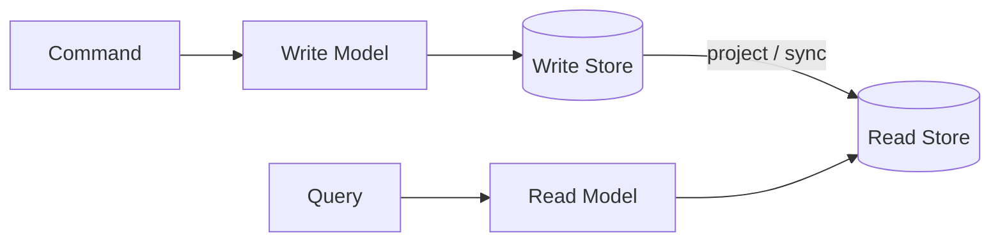

#### Benefits / costs
- **Benefit:** optimized reads; clearer command intent; independent scaling of reads/writes; pairs well with event-driven systems and materialized views.
- **Cost:** more moving parts; eventual consistency between models; more code/data duplication; harder troubleshooting.

#### When not to use
Simple CRUD; small systems; teams not ready for eventual consistency.

#### Common mistakes
- Applying CQRS globally instead of to selected bounded contexts; using it to compensate for poor indexing; not communicating read-model staleness to users.
- Propagating only *some* state transitions to derived read models (search indexes, caches, rollup tables). Every state transition of the source entity must trigger propagation — lifecycle transitions (unpublish, deactivate, archive) are routinely forgotten, leaving orphaned documents that keep serving hidden data.
- Writing the full-rebuild path and the incremental path as two separate implementations. They drift, and a full rebuild then silently regresses fields only the incremental path writes. Share one projection function between both (or add a parity test), and keep the rebuild path documented and rehearsed.

---

### 6.4 Event Sourcing

#### Summary
Persist state as an **append-only sequence of events**; derive current state by replaying them. The event log is the source of truth.


Use snapshots to avoid replaying long histories; build read projections for queries.

#### Benefits / costs
- **Benefit:** complete audit trail; reconstruct any past state; temporal queries; natural fit for finance, logistics, workflow, collaboration.
- **Cost:** event-schema evolution is hard; needs snapshots/projections at scale; specialized debugging/data repair; **privacy deletion** conflicts with immutable history unless designed for.

#### When not to use
Simple CRUD; teams without event-modeling expertise; strict deletion requirements that immutable history can't satisfy.

#### Common mistakes
- Storing technical events instead of business events; replaying events that have side effects; no versioning strategy; assuming event sourcing is *required* for event-driven architecture (it is not).

---

### 6.5 Caching Strategies

#### Summary
Store frequently accessed data closer to the consumer to cut latency and load, across layers: client/browser, CDN/edge, application, database.

#### Patterns
- **Cache-aside (lazy loading):** app reads cache; on miss, reads source and populates cache. The most common pattern.
- **Read-through / write-through:** cache sits inline and loads/writes the source synchronously.
- **Write-behind (write-back):** cache acknowledges writes and persists asynchronously (risk of loss).
- **Refresh-ahead:** proactively refresh hot entries before expiry.

#### Hard problems
Cache **invalidation** and **stale data**; **cache stampedes** on expiry (mitigate with locks, request coalescing, jittered TTLs). Cache keys must include all relevant dimensions (locale, auth, device) — caching authorization-sensitive data on the wrong key is a security bug.

#### When not to use
Strongly consistent reads are required; data is so volatile that churn dominates.

---

### 6.6 Consistency Models & CAP/PACELC

#### Summary
Choose **strong** vs **eventual** consistency deliberately. Under a network partition, **CAP** says you choose Consistency *or* Availability; **PACELC** adds that *even without* a partition you trade **Latency** vs **Consistency**.

#### Examples
- **Strong:** financial balances, inventory decrement, unique-username — correctness over availability.
- **Eventual:** likes/counters, social feeds, product catalogs — availability/latency over instantaneous consistency.

See the full treatment in [06 §4.1–4.2](06-quality-attributes-tradeoffs.md#41-cap-theorem).

---

### 6.7 Data Mesh

#### Summary
Decentralized **analytical** data ownership: domains own and serve their data as products, on a self-serve platform, under federated governance — as an alternative to a single central data lake/warehouse team becoming a bottleneck.

#### Four principles
Domain-oriented ownership; data as a product; self-serve data platform; federated computational governance.

#### Trade-offs
Scales data ownership with the organization (a Conway-aligned, DDD-flavored idea) but needs platform investment and governance maturity; overkill for small organizations.

#### Sources
Zhamak Dehghani, *Data Mesh*.

---

## 7. Distributed Systems Resilience Patterns

Cloud design principles assume failure is inevitable: design for self-healing, redundancy, minimal coordination, scale-out, partitioning around limits, and operability.

### 7.1 Design for Self-Healing & Redundancy

- **Self-healing:** assume failures; auto-detect, isolate, and recover via retries, health checks, circuit breakers, bulkheads, and failover.
- **Redundancy:** eliminate single points of failure with replication (multi-instance, load balancers, DB replicas, multi-AZ/region). Beware **split-brain**; match redundancy to **RTO/RPO** rather than gold-plating everything.

### 7.2 Scale Out, Partition Around Limits

- **Scale out (horizontal):** prefer adding stateless instances over bigger machines; externalize state; enable autoscaling.
- **Partition/shard:** split by key (horizontal), by feature/columns (vertical), or by service (functional). Choose partition keys to avoid hotspots.

### 7.3 Circuit Breaker

#### Summary
Stop calling a failing dependency temporarily so failures don't cascade; fail fast and degrade gracefully.

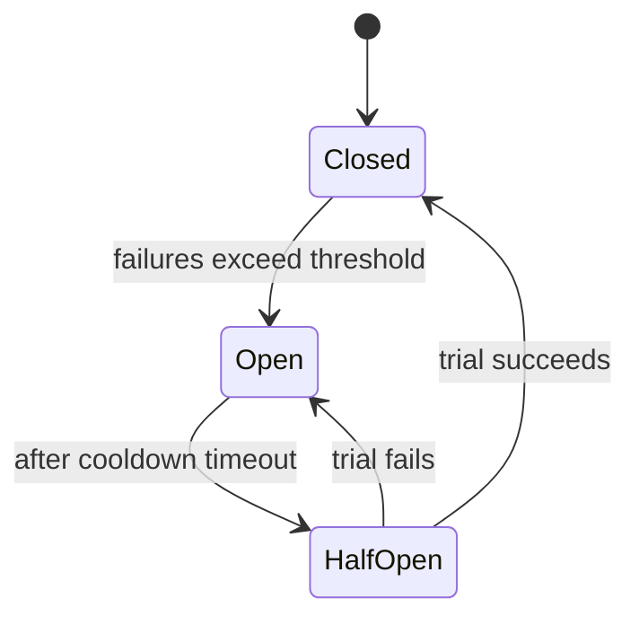

#### Trade-offs / mistakes
Needs thresholds, fallbacks, and metrics on open/half-open states. Mistakes: circuit breaker without timeouts; fallback returns misleading data; no observability of breaker state.

### 7.4 Bulkhead

#### Summary
Isolate resources (thread/connection pools, instances, queues) per dependency or tenant so one failing area can't consume all capacity — like watertight ship compartments. Prevents "noisy neighbor" starvation.

#### Trade-offs
Partitioning reduces utilization and needs capacity planning. Mistakes: no separate limits for background vs user-facing work; critical jobs share a queue with bulk jobs.

### 7.5 Retry with Backoff & Jitter

#### Summary
Retry **transient** failures with exponential backoff plus **jitter** and a cap, to avoid the **thundering herd** / self-inflicted DDoS.

#### When not to use
Non-idempotent operations without safeguards; validation/auth errors; long-running requests where retrying harms UX. Combine with timeouts and circuit breakers; don't retry at every layer (it multiplies attempts).

### 7.6 Timeouts & Deadlines

#### Summary
Bound every remote call's duration and **propagate deadlines** through call chains so the system fails fast instead of hanging. *Every remote call. Always.*

### 7.7 Idempotency

#### Summary
Design operations so repeating them yields the same result as doing them once — essential under at-least-once delivery and retries. Mechanisms: idempotency keys, conditional updates, naturally idempotent verbs (PUT/DELETE), dedup tables.

### 7.8 Minimize Coordination

#### Summary
Reduce synchronous coordination between components; prefer asynchronous communication, eventual consistency, and domain events. Coordination limits scalability (see the Universal Scalability Law, [06 §4.4](06-quality-attributes-tradeoffs.md#44-amdahls-law--the-universal-scalability-law)).

### 7.9 Rate Limiting & Throttling

#### Summary
Control request volume by client, user, tenant, operation, or resource to protect availability, ensure fairness, control cost, and prevent abuse.

#### When to use
Public APIs, multi-tenant systems, expensive operations, and abuse-prone endpoints (login, password reset, search, upload, AI calls). Communicate limits with `Retry-After` and rate-limit headers; align limits with tenant plans/SLOs. Avoid a single global limit for all operations.

### 7.10 Queue-Based Load Leveling

#### Summary
Insert a queue between producers and consumers to absorb bursts and process work at a controlled rate, smoothing spikes that would otherwise overload downstream services.

#### When to use / not use
- **Use** when work needn't complete synchronously and downstream throughput is limited (background jobs, imports, email, notifications, media processing).
- **Avoid** when the user requires an immediate confirmed result or queue delay breaks business expectations.

#### Common mistakes
Queue hides overload until the backlog is huge; no backpressure to producers; no alert on queue age.

---

## 8. Domain-Driven Design (DDD)

### 8.1 Overview

#### Summary
DDD tackles complexity in the **core domain** through **strategic design** (bounded contexts, context maps) and **tactical design** (entities, value objects, aggregates, domain events, repositories).

#### Caution
Avoid cargo-culting tactical patterns onto a CRUD app. DDD's biggest payoff is usually strategic — finding the right boundaries.

#### Sources
Eric Evans, *Domain-Driven Design*; Vaughn Vernon, *Implementing DDD*.

### 8.2 Ubiquitous Language

A shared, rigorous vocabulary used by domain experts and developers alike — and reflected directly in code. Each bounded context has its own language; the same word can mean different things in different contexts.

### 8.3 Bounded Contexts

#### Summary
An explicit boundary within which a model and its language are consistent. The same term ("Customer") legitimately means different things in different contexts.

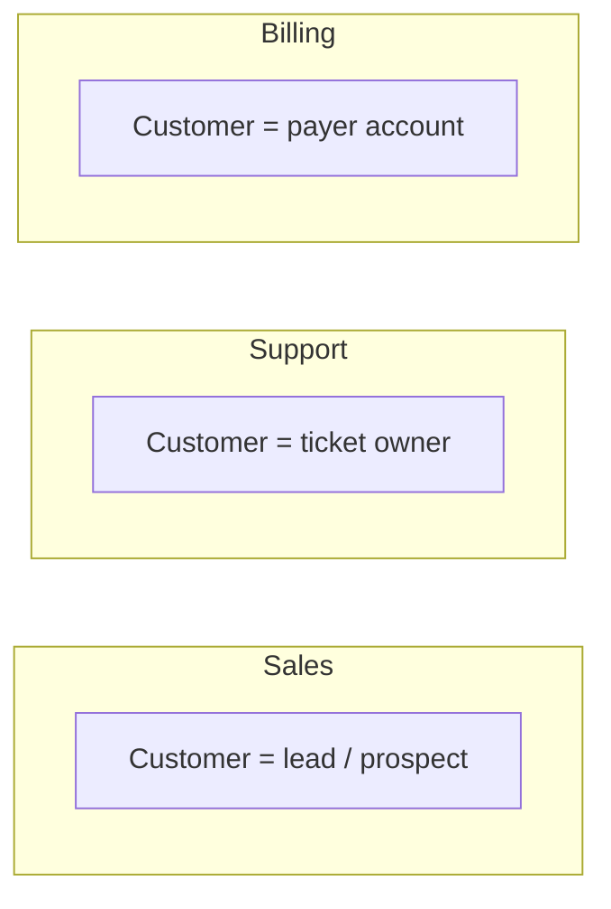

Bounded contexts are the natural seams for module/service boundaries.

### 8.4 Aggregates, Entities, Value Objects

- **Entity:** has a distinct identity over time (Customer, Order).
- **Value object:** defined by its attributes, immutable (Money, Address, DateRange).
- **Aggregate:** a consistency boundary accessed through an **aggregate root**; a transaction should not span multiple aggregates.

### 8.5 Context Mapping & Anti-Corruption Layer (ACL)

#### Summary
**Context maps** describe relationships between bounded contexts (partnership, customer-supplier, conformist, shared kernel). An **Anti-Corruption Layer** is a translation/firewall layer that protects a clean model from a foreign or legacy one.

#### When to use / not use
- **Use** when integrating legacy systems or vendor APIs whose concepts would pollute your domain, and during incremental modernization.
- **Avoid** when the external model is already the domain standard and should be adopted, or when mapping is trivial and stable.

#### Common mistakes
Letting external IDs/statuses leak everywhere; no tests for translation rules; ACL grows into a second domain model with no ownership.

---

## 9. Pattern Combination Guidance

**Useful combinations**
- Retry + timeout + circuit breaker for remote calls.
- Queue-based load leveling + competing consumers for bursty background work.
- Transactional outbox + idempotent consumers for reliable event publishing.
- API gateway + backend-for-frontend for multi-client systems.
- Strangler fig + anti-corruption layer for legacy modernization.
- CQRS + materialized views for complex read workloads.
- Deployment stamps + bulkheads for blast-radius control.

**Dangerous combinations**
- Microservices + shared database → distributed code with centralized coupling.
- Event-driven architecture without idempotency → duplicates become incidents.
- Retries without circuit breakers → overload amplification.
- CQRS everywhere → unnecessary model duplication.
- Gateway with business logic → bottleneck and ownership confusion.

---

## 10. Architectural Anti-Patterns

| Anti-pattern | Why it's harmful | Avoid by |
|---|---|---|
| **Big Ball of Mud** | No discernible structure; every change risky | Enforce module boundaries; refactor continuously |
| **Distributed Monolith** | Microservices that must deploy together — worst of both worlds | Stable contracts; independent data; async where possible |
| **Golden Hammer** | One favored tool forced onto every problem | Match solution to problem; evaluate alternatives |
| **Architecture Sinkhole** | Layers that only pass data through, adding no value | Allow open layers; question each layer's purpose |
| **Premature Optimization** | Complexity for unproven performance needs | Measure first; optimize hotspots only |
| **Premature Distribution** | Splitting into services before boundaries are known | Modular monolith first; extract when justified |
| **Accidental Complexity** | Self-inflicted complexity beyond the problem's essence | Attack accidental complexity (06 §8) |
| **God Object/Service** | One component knows/does too much | Single responsibility; redistribute behavior |
| **Anemic Domain Model** | Data-only objects with logic elsewhere | Put behavior with data (Tell, Don't Ask) |
| **Unmanaged Vendor Lock-in** | Hard, costly exit from a dependency | Conscious lock-in; abstraction only where exit is real |

> **Root cause:** applying a solution out of its valid context. **Cure:** match solution to the actual problem and constraints, and let architecture evolve.

---

## Sources

- Azure *Cloud Design Patterns*; microservices.io pattern language; Martin Fowler architecture articles; AWS/Azure/Google Well-Architected frameworks; Sam Newman, *Building Microservices* / *Monolith to Microservices*; Eric Evans, *Domain-Driven Design*; Unmesh Joshi, *Patterns of Distributed Systems*. Full list in [`09`](09-references.md).
