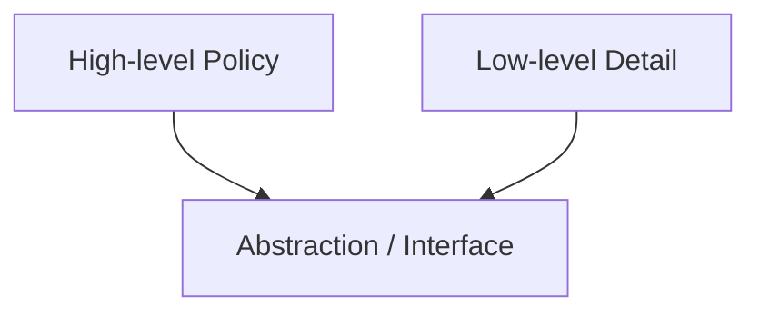

# Software Design Principles & Development Best Practices

Software design principles are **heuristics** — forces in tension, not laws. Applied mechanically they can make code worse. This file covers code- and module-level design: SOLID, the core heuristics (DRY/KISS/YAGNI and friends), coupling/cohesion/connascence, GRASP, design patterns (GoF and enterprise), code-level practices, error handling, testing, refactoring/technical debt, and the development process around them.

For *architectural* structure see [`01`](01-architecture-principles.md)/[`02`](02-architecture-patterns.md); for quality trade-offs see [`06`](06-quality-attributes-tradeoffs.md).

> Principles are forces in tension, not commandments — SOLID vs KISS, DRY vs decoupling, defensive vs offensive. Understand the *reasoning* so you know when to bend them.

---

## 1. SOLID Principles

SOLID (mnemonic by Michael Feathers; principles by Robert C. Martin) is five object-oriented design heuristics that also inform functional and modular design.

### 1.1 Single Responsibility Principle (SRP)

#### Summary
A class/module should have **one reason to change** — Martin's refinement: it should be responsible to **one actor** (one stakeholder or source of requirements).

#### Example
```text
// Violates SRP — three actors drive change:
class Employee {
  calculatePay()       // changed by Finance
  saveToDatabase()     // changed by DBAs
  generateReport()     // changed by Reporting
}

// Honors SRP:
class PayCalculator { calculatePay() }
class EmployeeRepository { save() }
class EmployeeReportBuilder { generateReport() }
```

#### Trade-offs
Over-splitting creates "class explosion" — many tiny classes with no clear value. Balance with KISS.

#### Decision checklist
- Does this unit have more than one reason to change? Are different stakeholders driving different methods? Is it a merge-conflict magnet?

---

### 1.2 Open–Closed Principle (OCP)

#### Summary
Software entities should be **open for extension, closed for modification** — add new behavior without editing existing, tested code, via abstraction and polymorphism.

#### Example
```text
// Closed to extension — must edit for each new shape:
function area(shape) {
  if (shape.type === 'circle') ...
  else if (shape.type === 'square') ...
}

// Open — add a new Shape implementation, don't touch existing code:
interface Shape { area(): number }
class Circle implements Shape { ... }
class Square implements Shape { ... }
```

#### Caveat
Don't add extension points speculatively (YAGNI). Introduce the abstraction when the **second or third** variant appears.

---

### 1.3 Liskov Substitution Principle (LSP)

#### Summary
Subtypes must be substitutable for their base types without breaking correctness — they may not strengthen preconditions, weaken postconditions, or violate invariants.

#### Example
```text
// Classic violation: Square extends Rectangle.
// setWidth() also sets height, breaking code that assumes
// independent width/height on a Rectangle.
```
LSP violations usually signal that inheritance is modeling **implementation reuse** rather than true substitutability — prefer composition.

---

### 1.4 Interface Segregation Principle (ISP)

#### Summary
Clients shouldn't depend on methods they don't use; prefer many small, role-specific interfaces over one "fat" interface.

#### Example
```text
// Fat: interface Worker { work(); eat() } — a Robot has no eat().
// Segregated: interface Workable { work() }, interface Feedable { eat() }
```
Risk: too many micro-interfaces can fragment understanding.

---

### 1.5 Dependency Inversion Principle (DIP)

#### Summary
High-level policy should not depend on low-level details; **both depend on abstractions**, and abstractions don't depend on details.



#### Example
```text
// Coupled: ReportService → new MySqlDatabase()
// Inverted: ReportService(db: Database)  // inject an abstraction
```
Realized via **Dependency Injection** (constructor/setter/parameter) or an IoC container. Underpins Hexagonal/Clean architecture. Risk: interfaces around *everything* add ceremony without value.

---

### 1.6 SOLID: Synthesis & Caveats

SOLID principles interact: SRP + ISP → cohesive units; OCP + DIP + LSP → safe polymorphic extension. They are guidelines, not laws — over-applying them ("patternitis", over-abstraction) fights KISS and YAGNI. Use them when they reduce real change cost.

---

## 2. Core Design Heuristics

### 2.1 DRY, DAMP, and the Cost of Coupling

#### Summary
**DRY** (Don't Repeat Yourself) means each piece of *knowledge* has one authoritative representation. But some *code* duplication is cheaper than the wrong coupling.

#### Description
DRY is about knowledge/intent, not identical-looking text. **True duplication** (one concept expressed twice) should be unified; **false/coincidental duplication** (two concepts that happen to look alike) should be left alone — unifying it creates coupling between things that will diverge.

- **DAMP** (Descriptive And Meaningful Phrases): tests and some code may be more verbose if it improves readability and intent.
- **AHA / WET:** "Avoid Hasty Abstractions" — prefer a little duplication until the right abstraction is clear (Sandi Metz: *"Duplication is far cheaper than the wrong abstraction."*).

#### When to apply DRY firmly
Business rules that must stay consistent; security/authorization decisions; complex algorithms; protocol/schema definitions.

#### When to allow duplication
Two pieces look similar but represent different business concepts; tests become unreadable from over-abstracted setup; a shared abstraction would need many flags/hooks.

---

### 2.2 KISS (Keep It Simple)

#### Summary
Prefer the simplest design that satisfies current known requirements and leaves room for likely change. KISS targets **accidental** complexity, not the **essential** complexity inherent in the problem ([06 §8](06-quality-attributes-tradeoffs.md#8-essential-vs-accidental-complexity)).

#### Common mistakes
Choosing a *simplistic* design that hides complexity rather than handling it; avoiding necessary abstraction even after repeated change proves it's needed.

---

### 2.3 YAGNI (You Aren't Gonna Need It)

#### Summary
Don't build a capability until there is a concrete need or high-confidence requirement.

#### Crucial exception
Things that are **expensive to retrofit** often *must* be designed early: security controls, audit logs, data retention/deletion, accessibility, observability, and hard-to-change storage/integration contracts. YAGNI applies to speculative *features and abstractions*, not to architecturally significant requirements ([01 §1.2](01-architecture-principles.md#12-architecturally-significant-decisions--reversibility)).

---

### 2.4 Separation of Concerns
Keep distinct concerns (validation, business logic, I/O, presentation) in distinct units. See [01 §2.1](01-architecture-principles.md#21-separation-of-concerns-soc).

### 2.5 Law of Demeter (Least Knowledge)
"Talk only to immediate friends." Avoid train-wreck chains like `a.getB().getC().doSomething()`, which couple a caller to a deep object graph. Related: **Tell, Don't Ask**. (Don't over-apply — some fluent/builder chains are fine.)

### 2.6 Composition Over Inheritance

#### Summary
Prefer **has-a** composition over **is-a** inheritance. Inheritance is the tightest coupling there is and suffers the **fragile base class** problem.

#### Example
```text
// Inheritance forces a bad model: Penguin extends Bird with fly() — penguins can't fly (LSP violation).
// Composition: a Bird HAS-A Movement strategy (Flying or Walking).
```
Use inheritance only for a true subtype relationship, framework requirements, or stable template behavior.

### 2.7 Encapsulate What Varies
Isolate the aspects most likely to change behind a stable interface — the foundation of Strategy, Factory, and Observer.

### 2.8 Program to an Interface, Not an Implementation
Depend on abstract roles, not concrete classes, to enable polymorphism and substitution (supports DIP).

### 2.9 Tell, Don't Ask
Tell objects what to do rather than querying their state and acting on their behalf; keep behavior with the data it concerns. (Anemic models, feature envy are the smells; CQRS reads and DTOs are legitimate exceptions.)

### 2.10 Principle of Least Astonishment (POLA)
Software should behave as a reasonable user expects; names and APIs should match conventions. Minimizes surprise for both users and developers.

### 2.11 Fail Fast
Detect and report errors early, near their cause — validate inputs, assert invariants, crash on programmer errors. Balance with resilience: fail the *request* fast, not the whole *system*.

### 2.12 Make Illegal States Unrepresentable

#### Summary
Design types, schemas, and constructors so invalid states are impossible or hard to create — pushing checks from runtime into the type system and constructors.

#### Apply to
Business invariants; security-sensitive permissions; money, time, units, identity, and lifecycle states. Avoid using strings for everything, boolean-flag combinations that allow impossible states, and optional fields without lifecycle constraints.

### 2.13 Functional Core, Imperative Shell

#### Summary
Put deterministic logic in **pure functions** (a "functional core") and isolate side effects (I/O, time, randomness) at the edges (an "imperative shell").

#### Benefits
Easier unit testing and reasoning; fewer hidden side effects. Works well for validation, calculations, transformations, policies, and UI state reducers. Mistakes: hiding I/O inside "utility" functions; pretending side effects don't exist.

### 2.14 Explicit Dependencies
Make dependencies visible through constructors, parameters, or imports rather than hidden globals/service locators or giant context objects. Improves testability and makes runtime behavior and coupling analyzable.

---

## 3. Coupling, Cohesion & Connascence

Builds on the fundamentals in [01 §2.3](01-architecture-principles.md#23-coupling--cohesion) with a finer-grained model.

### Connascence

#### Summary
A precise taxonomy of coupling (Meilir Page-Jones; popularized by Jim Weirich): two components are **connascent** if changing one requires changing the other. Connascence has **type, strength, degree,** and **locality**.

- **Static connascence (weaker → stronger):** Name → Type → Meaning/Convention → Position → Algorithm.
- **Dynamic connascence (stronger, runtime):** Execution (order) → Timing → Value → Identity.

#### Rules of thumb (Page-Jones)
1. **Minimize** overall connascence.
2. **Localize** it — minimize connascence that crosses encapsulation boundaries.
3. **Weaken** it — convert stronger forms to weaker (e.g., positional args → named args).

---

## 4. GRASP Principles

General Responsibility Assignment Software Patterns (Craig Larman) — nine principles that complement SOLID by answering *"who should do what?"*

| Principle | Guidance |
|---|---|
| **Information Expert** | Assign a responsibility to the class with the information needed to fulfill it |
| **Creator** | The class that aggregates/contains/closely uses B should create B |
| **Controller** | Assign system-event handling to a coordinating (non-UI) object |
| **Low Coupling** | Assign responsibilities to keep coupling low |
| **High Cohesion** | Keep each class focused and manageable |
| **Polymorphism** | Handle type-based variation with polymorphism, not conditionals |
| **Pure Fabrication** | Invent a non-domain class (e.g., Repository) to keep cohesion/coupling healthy |
| **Indirection** | Introduce a mediator (adapter, controller) to decouple |
| **Protected Variations** | Wrap predicted variation points behind a stable interface (≈ OCP + encapsulate-what-varies) |

---

## 5. Design Patterns (GoF)

Reusable named solutions to recurring design problems (Gang of Four: Gamma, Helm, Johnson, Vlissides). Let patterns **emerge from refactoring**; forcing them everywhere ("patternitis") adds complexity. In dynamic/functional languages, functions and first-class behavior collapse many patterns.

### 5.1 Creational

| Pattern | Solves | Watch out for |
|---|---|---|
| **Factory Method** | Defer instantiation to subclasses | Over-abstraction for simple `new` |
| **Abstract Factory** | Families of related objects | Rigid family hierarchies |
| **Builder** | Step-by-step construction of complex objects | Overkill for simple objects |
| **Prototype** | Clone existing objects | Deep vs shallow copy bugs |
| **Singleton** | One shared instance | Often an **anti-pattern**: global state, hidden coupling, hard to test — prefer DI of a single instance |

### 5.2 Structural

| Pattern | Solves |
|---|---|
| **Adapter** | Make incompatible interfaces work together |
| **Decorator** | Add behavior dynamically without subclassing |
| **Facade** | Simplify a complex subsystem behind one interface |
| **Proxy** | Control access (lazy load, remote, protection) |
| **Composite** | Treat trees of objects uniformly |
| **Bridge** | Decouple abstraction from implementation |
| **Flyweight** | Share fine-grained objects to save memory |

### 5.3 Behavioral

| Pattern | Solves |
|---|---|
| **Strategy** | Interchangeable algorithms |
| **Observer** | Notify dependents of state changes |
| **Command** | Encapsulate a request as an object (undo, queue) |
| **State** | Behavior changes with internal state |
| **Template Method** | Fix an algorithm skeleton, vary steps |
| **Iterator** | Traverse without exposing internals |
| **Mediator** | Centralize complex inter-object communication |
| **Chain of Responsibility** | Pass a request along a handler chain |
| **Visitor** | Add operations to object structures without changing them |
| **Memento** | Capture/restore state (undo) |

---

## 6. Enterprise Application Patterns (PoEAA)

From Martin Fowler's *Patterns of Enterprise Application Architecture*.

| Pattern | Description | When to use / trade-offs |
|---|---|---|
| **Repository** | Mediates between domain and data mapping; collection-like interface | Rich domains; decouples persistence |
| **Unit of Work** | Tracks changes and commits them as one transaction | Coordinating multiple writes |
| **Data Mapper** | Moves data between objects and DB, keeping them independent | Complex domains; more setup |
| **Active Record** | Object wraps a row and its DB access | Simple CRUD; couples domain to schema |
| **Service Layer** | Defines application boundary and orchestrates use cases | Multiple clients/transactions |
| **DTO** | Carries data across boundaries without behavior | Reduce round trips; API contracts |
| **Domain Model** | Rich object model of behavior + data | Complex business logic |
| **Table/Row Data Gateway** | One object per table/row mediating DB access | Simpler data access |
| **Identity Map** | Ensures each object loaded once per session | Avoid duplicates/inconsistency |
| **Lazy Load** | Defer loading until needed | Beware the **N+1 query** problem ([04 §9.2](04-web-application-design.md#92-the-n1-query-problem)) |

**Key axis:** Active Record (simple, coupled to schema) vs Data Mapper + Repository + Domain Model (more complex, decoupled).

---

## 7. Code-Level Best Practices

### 7.1 Naming
Intention-revealing, pronounceable, searchable names from the ubiquitous language. Functions = verbs; classes = nouns; booleans as predicates (`isActive`). Avoid `data`/`info`/`manager`/`temp`, magic numbers, and inconsistent vocabulary (pick `fetch`/`get`/`load` and stick with it).

### 7.2 Function & Class Size
Small, focused functions doing one thing at one level of abstraction; cohesive classes; avoid god classes. Balance against over-fragmentation (ping-ponging across 20 one-line functions can be as bad as a 300-line one).

### 7.3 Self-Documenting Code vs Comments
Express intent in code; reserve comments for **why**, not **what**. Avoid commented-out code, comments restating code, and misleading/outdated comments.

### 7.4 Immutability & Pure Functions
Prefer immutable data and pure functions (output depends only on input, no side effects): thread-safe, cacheable/memoizable, easy to test. Trade-off: copying overhead in hot paths and inherently stateful subsystems.

### 7.5 Guard Clauses & Early Returns
Handle edge cases up front with early returns to keep the happy path flat and readable. Ensure resource cleanup via `finally`/`using`/`defer`/RAII.

### 7.6 Principle of Least Privilege (in code)
Minimum access and visibility: prefer `private`, narrow scopes, immutable-by-default, least-privileged credentials. (Security detail in [04 §7](04-web-application-design.md#7-web-application-security) and [07](07-security-reliability-operations.md).)

---

## 8. Error Handling & Robustness

Errors are part of the API and the user experience — design them deliberately.

### 8.1 Exceptions vs Result Types vs Error Codes

| Strategy | Pros | Cons | Best for |
|---|---|---|---|
| **Exceptions** | Clean happy path; rich context | Hidden control flow; easy to swallow | Truly exceptional conditions |
| **Result/Either types** | Explicit, type-checked outcomes | More verbose; needs language support | Expected failures (validation, parsing) |
| **Error codes** | Simple, language-neutral | Easy to ignore; no context | C-style/FFI boundaries |

**Best practices:** don't swallow errors silently; don't use exceptions for normal control flow; preserve causal context; fail at the right level; always clean up resources.

### 8.2 Error Handling as Design
Distinguish error categories: validation, authentication, authorization, conflict, dependency failure, timeout, rate limit, internal. Include stable **machine-readable codes** for API errors; preserve the causal chain in logs; never leak secrets, internal details, or stack traces to users; make **retryability explicit**; treat partial failure as normal in distributed systems.

### 8.3 Defensive vs Offensive (Contract) Programming
**Defensive** (assume bad inputs, validate, degrade gracefully) at **trust boundaries**; **offensive / Design by Contract** (preconditions, postconditions, invariants; fail fast/assert) for **internal** code you control.

---

## 9. Testing Principles

### 9.1 The Test Pyramid (and Trophy)
Mike Cohn's pyramid: many fast **unit** tests at the base, fewer **integration**, few **E2E** at the top. Avoid the **ice-cream-cone** anti-pattern (mostly slow E2E/manual). A modern nuance — Kent C. Dodds's **Testing Trophy** — elevates integration tests and puts static analysis/types at the base.

```
        ╱╲      E2E (few, slow, high-confidence)
       ╱──╲     Integration (some)
      ╱────╲    Unit (many, fast)
     ╱──────╲   Static analysis / types (foundation)
```

### 9.2 TDD
**Red → Green → Refactor:** write a failing test, write minimal code to pass, then refactor under green tests. Drives testable design; relax for spikes and exploratory UI work.

### 9.3 BDD
Extends TDD with business-readable specifications (**Given/When/Then**, often via Gherkin) to build shared understanding between business and engineering.

### 9.4 Test Doubles
- **Dummy** — placeholder, never used.
- **Stub** — returns canned responses.
- **Spy** — records how it was called.
- **Mock** — pre-programmed with expectations it verifies.
- **Fake** — lightweight working implementation (e.g., in-memory DB).

Mock at seams you own; over-mocking locks in implementation details. Prefer **contract tests** at service boundaries.

### 9.5 FIRST Principles
Good tests are **F**ast, **I**ndependent, **R**epeatable, **S**elf-validating, **T**imely.

### 9.6 Contract Testing
Consumer-driven contracts (e.g., Pact) verify that services agree on their interaction without a full integration environment — ideal for microservices.

### 9.7 Mutation Testing
Introduce small faults ("mutants") to measure test-suite quality: surviving mutants reveal weak assertions. Coverage measures execution, not assertion quality.

### 9.8 Testability Is a Design Property
Code is testable when dependencies, side effects, and boundaries are clear. Prefer fast unit tests for pure/domain logic, integration tests for DB/messaging/external boundaries, contract tests for service APIs, and end-to-end tests sparingly for critical journeys. Avoid testing implementation details and slow suites that block frequent integration. Don't forget tests around **data migrations**.

---

## 10. Refactoring, Code Smells & Technical Debt

### 10.1 Refactoring
Improving internal structure without changing external behavior (Fowler) in small, behavior-preserving steps under test. The **Boy Scout Rule**: leave code cleaner than you found it. *"Make the change easy, then make the easy change."* Use characterization tests when refactoring untested legacy code. Don't mix behavior change with structural change; commit incrementally; don't refactor code about to be deleted.

### 10.2 Code Smells

| Smell | Indicates | Common fix |
|---|---|---|
| **Long Method** | Doing too much | Extract Method |
| **Large Class / God Object** | Too many responsibilities | Extract Class |
| **Long Parameter List** | Poor grouping | Parameter Object |
| **Duplicated Code** | Knowledge duplication | Extract & reuse |
| **Feature Envy** | Method covets another class's data | Move Method |
| **Data Clumps** | Same fields travel together | Extract value object |
| **Primitive Obsession** | Primitives for domain concepts | Value objects |
| **Shotgun Surgery** | One change touches many classes | Consolidate responsibility |
| **Divergent Change** | One class changes for many reasons | Split by responsibility (SRP) |
| **Switch/Type Code** | Type branching everywhere | Polymorphism |
| **Message Chains** | `a.b().c().d()` | Hide delegate (Law of Demeter) |
| **Speculative Generality** | Unused flexibility | Remove (YAGNI) |

### 10.3 Technical Debt
The implied future cost of an expedient solution now (Ward Cunningham's metaphor); it accrues "interest." Fowler's **quadrants**:

| | **Deliberate** | **Inadvertent** |
|---|---|---|
| **Prudent** | "We must ship now; we'll deal with consequences" | "Now we know how we should have done it" |
| **Reckless** | "We don't have time for design" | "What's layering?" |

**Manage it:** make debt visible (backlog/register), pay down high-interest debt first, and budget for it continuously. Severe, pervasive debt may mean "bankruptcy" (rewrite) — but rewrites are risky; prefer incremental strangling ([02 §4.8](02-architecture-patterns.md#48-strangler-fig-legacy-modernization)).

---

## 11. Development Process & Collaboration

### 11.1 Version Control Hygiene
Small, atomic commits with meaningful messages (explain *why*); isolate features; never commit secrets.

| Strategy | Description | Best for |
|---|---|---|
| **Trunk-Based Development** | Frequent integration to main; short-lived branches; feature flags for incomplete work | Continuous delivery, strong test suites |
| **GitHub/GitLab Flow** | Feature branches + main; environment/release branches | Most teams |
| **Git Flow** | Long-lived develop/release/hotfix branches | Scheduled releases, multiple supported versions |

### 11.2 Continuous Integration & Delivery/Deployment
**CI:** integrate frequently with automated build and tests. **CD (Delivery):** always releasable at the push of a button. **CD (Deployment):** every passing change auto-releases to production. Typical pipeline: commit → build → unit → integration → security/quality scans → artifact → staging → smoke/E2E → prod (canary/blue-green) → monitor. (Detail in [07 §9](07-security-reliability-operations.md#9-continuous-delivery).)

### 11.3 Code Review
Peer review before merge for correctness, design, readability, security, and tests. Keep PRs small; automate style/lint; review behavior and design (not just style); be kind and specific; avoid bikeshedding; check migrations and config; ensure tests cover intent, not just lines. Reduces bus-factor.

### 11.4 Pair & Mob Programming
Two (pair) or more (mob) developers at one workstation with driver/navigator roles — useful for complex problems, onboarding, and knowledge spread; weigh against throughput for routine work.

### 11.5 DevOps Culture
Unify dev and ops ("you build it, you run it") through automation, feedback, and continuous improvement. **CALMS** (Culture, Automation, Lean, Measurement, Sharing) and **DORA metrics** (deployment frequency, lead time for changes, change failure rate, time to restore) — elite performers deploy *more* frequently *and* more reliably.

### 11.6 Feature Toggles (Flags)
Gate features behind runtime flags to decouple deploy from release. Categories: **release**, **experiment** (A/B), **ops** (kill switches), **permission**. Set owners and expiry; remove release flags after rollout to avoid flag debt. (Detail in [07 §11](07-security-reliability-operations.md#11-feature-flags).)

### 11.7 Dependency Management
Dependencies carry security, licensing, maintenance, and operational risk. Prefer maintained dependencies with clear licenses; pin versions/use lockfiles; automate vulnerability scanning; remove unused dependencies; track transitive risk; maintain an SBOM for serious products. Avoid tiny dependencies for trivial code when the supply-chain risk outweighs the benefit. (Supply chain detail in [07 §4](07-security-reliability-operations.md#4-supply-chain-security).)

---

## Key Cross-References
- **Architecture** that frames these choices: [`01`](01-architecture-principles.md), [`02`](02-architecture-patterns.md).
- **Web** and **desktop** applications: [`04`](04-web-application-design.md), [`05`](05-desktop-application-design.md).
- **Quality attributes & trade-offs:** [`06`](06-quality-attributes-tradeoffs.md).
- **Delivery & operations:** [`07`](07-security-reliability-operations.md).

> Principles are forces in tension. The skill is not memorizing them — it's knowing which to apply, which to bend, and why, in *this* context.
