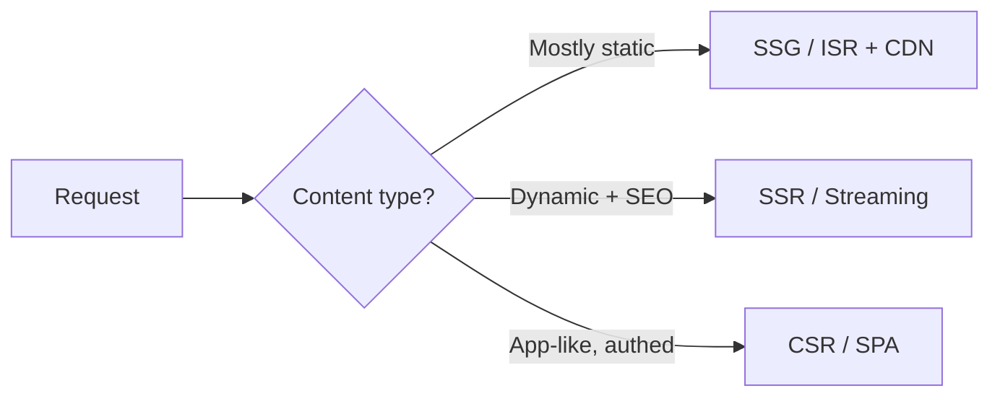
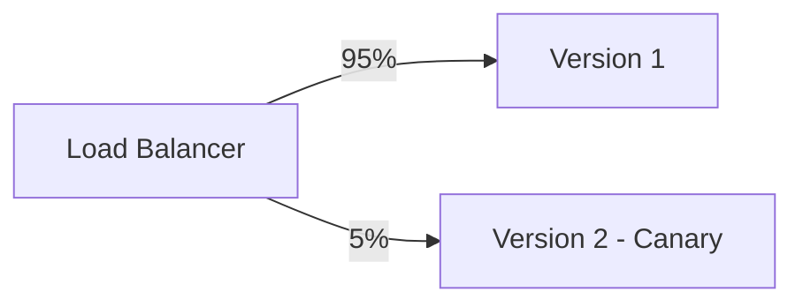

# Web Application Design & Architecture

Web applications are distributed systems with a human interface. They run across browsers, networks, CDNs, servers, APIs, databases, identity providers, third-party scripts, and user devices. Good web architecture treats **performance, accessibility, security, privacy, and operability** as first-class concerns.

This file builds on the architecture and design principles in [`01`](01-architecture-principles.md)–[`03`](03-software-design-principles.md), and the operations practices in [`07`](07-security-reliability-operations.md).

> **Web meta-principle:** *The web is a hostile, unreliable environment — never trust the client, expect failure, measure everything, and degrade gracefully.*

---

## 1. The Twelve-Factor App (and Beyond)

#### Summary
The Twelve-Factor methodology (Adam Wiggins / Heroku) is the de-facto baseline for cloud-native, portable, scalable apps with continuous delivery.

| # | Factor | Principle |
|---|---|---|
| I | Codebase | One codebase tracked in version control, many deploys |
| II | Dependencies | Explicitly declare and isolate dependencies |
| III | Config | Store config in the environment (or external config stores) |
| IV | Backing services | Treat backing services as attached resources |
| V | Build, release, run | Strictly separate the stages |
| VI | Processes | Execute as stateless, share-nothing processes |
| VII | Port binding | Export services via port binding |
| VIII | Concurrency | Scale out via the process model |
| IX | Disposability | Fast startup and graceful shutdown |
| X | Dev/prod parity | Keep environments as similar as possible |
| XI | Logs | Treat logs as event streams |
| XII | Admin processes | Run admin/management tasks as one-off processes |

#### Beyond 12-Factor
Modern additions (Kevin Hochstein and others): **API-first** design; **telemetry/observability** as first-class; **authentication/authorization** as an explicit concern; modern **secret managers** (environment variables alone are insufficient for secrets).

#### Decision checklist
- Is config externalized and secrets separated? Are processes stateless/disposable? Are logs streamed? Is dev/prod parity maintained?

---

## 2. Frontend Architecture

### 2.1 Component-Based UI
Build UIs from composable, encapsulated, reusable components with inputs (props) and outputs (events) — React, Vue, Angular, Web Components. Keep components small and single-responsibility; separate **container** (data/logic) from **presentational** (rendering) components; lift shared state; use a design system for consistency (not as a dumping ground); co-locate related code.

### 2.2 State Management
Match each kind of state to the right tool. Keep **server state, client/UI state, global app state, form state,** and **URL state** distinct.

- **Server state** (caches): React Query / SWR / Apollo — needs invalidation, not duplication into a global store.
- **Global client state:** Redux, Zustand, Pinia, NgRx.
- **URL state:** for shareable/bookmarkable view state.

Decision criteria: Is state local to one component? Should it live in the URL for shareability? Is it server-owned and cacheable? Does it need optimistic updates? Must it survive reloads? Is it sensitive? The most common mistake is conflating server and client state.

### 2.3 Progressive Enhancement & Graceful Degradation
**Progressive enhancement** builds from a semantic, server-rendered baseline up; **graceful degradation** starts rich and falls back. Both improve resilience, accessibility, and SEO on weak devices/networks. Relax only for internal tools with a guaranteed capable client.

---

## 3. Rendering Strategies

#### Summary
Where and when HTML is generated drives performance, SEO, and complexity.

| Strategy | Rendered | Best for | Trade-offs |
|---|---|---|---|
| **CSR / SPA** | Client | Authenticated app-like tools | Large JS; slower first load; SEO/a11y pitfalls |
| **SSR** | Server per request | SEO + dynamic content, dashboards | Server cost; needs caching; hydration cost |
| **SSG** | Build time | Docs, marketing, blogs | Build-time data freshness limits |
| **ISR** | Build + revalidate | Large mostly-static catalogs | Some staleness window |
| **Streaming SSR / RSC** | Server, progressively | Fast first paint with dynamic data | Framework/mental-model complexity |
| **Edge rendering** | CDN edge | Global low-latency personalization | Edge runtime limits |

Meta-frameworks let you mix strategies **per route**. Decision criteria: Is SEO important? Is the first screen public or authenticated? How much JS does the initial task need? What are device/network constraints? Is offline support needed? Can the team operate SSR infrastructure?

---

## 4. Frontend Performance & Core Web Vitals

### 4.1 Core Web Vitals & Performance Budgets
Google's user-centric metrics (measure at the **75th percentile**, segmented across mobile and desktop):

- **Largest Contentful Paint (LCP)** — *loading*. Good: **≤ 2.5 s**.
- **Interaction to Next Paint (INP)** — *responsiveness*. Good: **≤ 200 ms**. (Replaced First Input Delay as a Core Web Vital in 2024.)
- **Cumulative Layout Shift (CLS)** — *visual stability*. Good: **≤ 0.1**.

Supporting (diagnostic) metrics include **TTFB** and **FCP** (loading) and **TBT** (a lab proxy for INP). Define a **performance budget** (bundle size, request count, metric thresholds) and enforce it in CI — but rely on **field/real-user data**, not only lab tools like Lighthouse, since they can diverge.

### 4.2 Performance Techniques
| Technique | Effect |
|---|---|
| Code splitting / lazy loading | Ship less JS up front |
| Tree shaking | Drop unused code |
| Asset optimization (WebP/AVIF, minify) | Smaller payloads |
| Caching (HTTP/CDN/service worker) | Fetch less, faster |
| CDN / edge | Serve closer to users |
| Critical CSS / above-the-fold | Faster first paint |
| Preload / prefetch / preconnect | Prioritize key resources |
| Debounce / throttle | Less work on input |
| List virtualization | Render only visible items |
| Reserve layout space | Avoid CLS from images/ads/embeds |

Reasoning: *ship less, fetch less and closer, do less on the main thread.*

---

## 5. Accessibility (a11y)

#### Summary
Accessibility is a design and engineering requirement, not a final audit task. It reaches a large population (commonly cited as ~15%+ of users have a disability) and reduces legal/compliance risk (ADA, Section 508, EAA).

**WCAG** organizes guidance under **POUR** — Perceivable, Operable, Understandable, Robust. Target current stable **WCAG 2.2 Level AA** (verify against w3.org/WAI for the latest version before a production decision — see [09](09-references.md)).

#### Guidance
- Use **semantic HTML before ARIA**; add ARIA only where needed.
- Full keyboard navigation with visible focus states.
- Sufficient color contrast (≥ **4.5:1** for normal text); never rely on color alone.
- Label form controls and errors; alt text for meaningful images.
- Manage focus in modals/dialogs; respect **reduced-motion** preferences.
- Test critical flows with screen readers; include a11y acceptance criteria in stories.

#### Standards & regulatory drivers
WCAG is the technical foundation, but the standard an EU compliance review actually names is often **EN 301 549** — the EU's harmonized ICT accessibility standard, which incorporates WCAG by reference and extends it to non-web ICT (native apps, documents, self-service terminals). The **European Accessibility Act (EAA)** is the EU directive requiring accessibility for a range of consumer products/services (e-commerce, banking, e-books…), with compliance deadlines from **June 2025** — relevant to any EU-facing product, not just public-sector ones. In the US, **Section 508** governs federal procurement and the **ADA** underlies broader accessibility case law. Underlying all of these, **ISO 9241-210** defines the *human-centred design process* (understand context → specify requirements → produce design solutions → evaluate, iteratively) that good accessibility practice is embedded in, rather than being a separate conformance checklist bolted onto a finished design. Full crosswalk: [`13` §8](13-standards-crosswalk.md#8-accessibility).

#### Common mistakes
Div-based custom controls without keyboard behavior; removing focus outlines; placeholder text as the only label; modals that trap/lose focus; infinite scroll without accessible navigation. (The "curb-cut effect": accessibility improvements often help everyone.)

---

## 6. API Design

### 6.1 REST & the Richardson Maturity Model
REST is structured around resources, HTTP methods (GET/POST/PUT/PATCH/DELETE), and status codes.

- **Level 0:** RPC over HTTP (the "swamp of POX").
- **Level 1:** Resources / URIs.
- **Level 2:** HTTP verbs + status codes (most "RESTful" APIs).
- **Level 3:** HATEOAS (hypermedia controls).

Best practices: noun-based URIs (`/orders/123`); pagination/filtering/sorting on collections; idempotent PUT/DELETE; HTTPS only; rate limiting; intentional versioning.

### 6.2 API Versioning
| Strategy | Example | Trade-off |
|---|---|---|
| URI | `/v1/orders` | Visible, cache-friendly; couples version to path |
| Header | `Accept: application/vnd.api.v2+json` | Clean URIs; less discoverable |
| Query param | `?version=2` | Easy; can be missed/cached wrong |

Prefer **additive, backward-compatible** evolution; publish deprecation timelines.

### 6.3 REST vs GraphQL vs gRPC
(See also [02 §5.1](02-architecture-patterns.md#51-synchronous-requestresponse-rest-rpc-grpc-graphql).)

| Dimension | REST | GraphQL | gRPC |
|---|---|---|---|
| Best for | Public, resource CRUD | Diverse clients, flexible queries | Internal service-to-service |
| Data fetching | Fixed endpoints | Client-specified | Defined RPCs |
| Over/under-fetch | Common | Minimized | Minimal |
| Caching | Easy (HTTP) | Harder | Custom |
| Format | JSON (text) | JSON | Protobuf (binary) |
| Browser | Native | Native | Needs gRPC-Web proxy |
| Watch out | Many round trips | N+1, query cost, auth | Less web-native |

### 6.4 API-First / Contract-First
Design the contract (OpenAPI / AsyncAPI / Protobuf) before implementation as the single source of truth — enabling parallel development against mocks, generated docs/clients/servers, and earlier security review. Best for multiple teams, public APIs, and microservices. Note that shared DTO/contract types are compile-time promises only: each boundary still needs runtime validation of incoming payloads to catch contract drift between independently deployed sides ([03 §2.1](03-software-design-principles.md#21-dry-damp-and-the-cost-of-coupling)).

**Named contract standards worth knowing:** **OpenAPI** (REST contract format), **AsyncAPI** (its event-driven/messaging counterpart), **JSON:API** (a specific opinionated convention for resource shape, relationships, and pagination), and **RFC 9457 (Problem Details for HTTP APIs)** — a standardized JSON shape (`type`/`title`/`status`/`detail`/`instance`) for machine-readable API error responses, worth adopting instead of inventing a bespoke error envelope (ties to the error-category guidance in [03 §8.2](03-software-design-principles.md#82-error-handling-as-design)). OAuth's current IETF track is **OAuth 2.1**, which consolidates security best-practice (mandatory PKCE, dropped implicit/password grants) that this guide's [§8.2](#82-oauth-20--openid-connect-oidc) already recommends as practice.

### 6.5 Webhooks, Streaming, WebSockets & SSE
- **Webhooks:** async notifications to external systems — sign payloads, include event IDs, support retries and idempotency, document ordering.
- **Streaming / WebSockets / SSE:** real-time updates where polling is inefficient — design heartbeat, reconnect, and backpressure; mind connection-scaling cost.

### 6.6 Idempotency, Pagination & Rate Limiting
- **Idempotency keys** for unsafe operations that may be retried (payments, orders) — see [02 §7.7](02-architecture-patterns.md#77-idempotency).
- **Pagination:** prefer **cursor-based** over offset for large/changing datasets.
- **Rate limiting:** communicate via `X-RateLimit-*` and `Retry-After` headers.

#### Common mistakes
API mirrors database tables; breaking clients without a migration path; no idempotency for payment/order operations; ambiguous null fields.

---

## 7. Web Application Security

### 7.1 OWASP Top 10 (2025)
The OWASP Top 10 is the standard awareness baseline for the most critical web application security risks. The current release is **2025**.

| 2025 Rank | Category | Key defenses |
|---|---|---|
| **A01** | **Broken Access Control** | Deny by default; enforce server-side; no IDOR; check object ownership. (Now also absorbs **SSRF**.) |
| **A02** | **Security Misconfiguration** | Hardened defaults; least privilege; disable unused features; secure headers |
| **A03** | **Software Supply Chain Failures** | SBOM; pin/lock dependencies; verify provenance; scan; protect the build pipeline (**new/expanded for 2025**) |
| **A04** | **Cryptographic Failures** | TLS everywhere; encrypt sensitive data at rest; modern algorithms; protect keys |
| **A05** | **Injection** | Parameterized queries; output encoding; validate input (covers SQLi, XSS, command injection) |
| **A06** | **Insecure Design** | Threat modeling; secure design patterns; misuse/abuse cases |
| **A07** | **Authentication Failures** | MFA; strong session/token handling; breached-password checks; lockout |
| **A08** | **Software or Data Integrity Failures** | Verify update/signature integrity; avoid insecure deserialization; trusted CI/CD |
| **A09** | **Security Logging & Alerting Failures** | Log security events; monitor; alert on abuse; protect log integrity |
| **A10** | **Mishandling of Exceptional Conditions** | Fail securely; handle errors without leaking internals; correct error/edge-case logic (**new for 2025**) |

> **Mapping from OWASP Top 10:2021.** Broken Access Control remains #1. **Security Misconfiguration** rose to #2; **Cryptographic Failures** and **Injection** shifted to #4/#5; **Insecure Design** and **Authentication Failures** to #6/#7. The 2021 standalone **SSRF (A10:2021)** is folded into Broken Access Control. Two categories are new/reframed for 2025: **Software Supply Chain Failures (A03)** (expanding 2021's "Vulnerable & Outdated Components" / "Software & Data Integrity") and **Mishandling of Exceptional Conditions (A10)**. *Always verify against the current primary source ([`09`](09-references.md)) before relying on rankings.*

### 7.2 Core Security Principles
- **Defense in Depth** — layered controls (WAF + validation + parameterized queries + least privilege + monitoring).
- **Least Privilege** — minimum access necessary.
- **Secure by Design / Shift Left** — security from the start, not bolted on.
- **Zero Trust** — *never trust, always verify*; authenticate/authorize every request.
- **Fail Securely** — errors default to denying access, not granting it. This includes the *configuration* dimension: a missing key, secret, or setting must disable the **feature**, not the **control**. Verification code gated on the presence of its own key (`if (key) verify(...)`) is fail-open by construction, and an unset shared secret that compares equal to an absent header is an authentication bypass. Refuse to start, or refuse the request, when a security-relevant setting is absent.
- **Never Trust User Input** — validate and encode everything from the client.

### 7.3 Common Attack Defenses

| Attack | Defenses |
|---|---|
| **XSS** | CSP; output encoding; avoid `innerHTML`/`dangerouslySetInnerHTML` |
| **SQL Injection** | Prepared statements / parameterized queries / ORM |
| **CSRF** | Anti-CSRF tokens; `SameSite` cookies; verify Origin/Referer |
| **Clickjacking** | `X-Frame-Options: DENY`; CSP `frame-ancestors` |
| **Sensitive data exposure** | TLS; encrypt at rest; minimize collection |
| **Brute force / credential stuffing** | MFA; lockout/throttling; breached-password checks |
| **SSRF** | Allowlist egress; validate/normalize URLs; block internal metadata endpoints |

**Essential security headers:** `Strict-Transport-Security` (HSTS), `Content-Security-Policy`, `X-Content-Type-Options: nosniff`, `X-Frame-Options`, `Referrer-Policy`, `Permissions-Policy`.

#### Standards
OWASP Top 10 is an *awareness* baseline, not a verification standard. For a system that needs a formal, verifiable set of security requirements (a contract, an audit, a certification target), pair it with **OWASP ASVS** (already cited, [09](09-references.md)) and **ISO/IEC 27034** (application security integrated into the SDLC — the ISO counterpart to ASVS/SSDF, [07 §1](07-security-reliability-operations.md#1-secure-software-development-lifecycle-ssdf)). Full crosswalk: [`13` §4](13-standards-crosswalk.md#4-security--management-application-and-sdlc-standards).

---

## 8. Authentication & Authorization

### 8.1 Sessions vs Tokens (JWT)
| | Server sessions | JWT (stateless) |
|---|---|---|
| State | Server-side store | Self-contained token |
| Revocation | Easy (delete session) | Hard (until expiry) |
| Scalability | Needs shared store | Scales statelessly |
| Size | Small cookie | Larger token |
| Best for | Traditional web apps | APIs, distributed services |

Core trade-off: revocability/control vs. statelessness/scalability. Mitigate JWT downsides with short-lived access tokens + refresh tokens; store tokens in secure `HttpOnly`, `SameSite` cookies rather than `localStorage`.

### 8.2 OAuth 2.0 & OpenID Connect (OIDC)
**OAuth 2.0** is an authorization framework; **OIDC** adds an authentication layer (ID token). Use the **Authorization Code flow with PKCE** for web/mobile/SPA, and **Client Credentials** for service-to-service. Avoid the deprecated **Implicit** and **Resource Owner Password** grants. Prefer managed identity providers (SSO, federation, MFA).

### 8.3 RBAC vs ABAC
| | RBAC | ABAC |
|---|---|---|
| Model | Roles → permissions | Policies over attributes |
| Granularity | Coarse | Fine |
| Simplicity | Simple | More complex |
| Scaling issue | "Role explosion" | Policy complexity |
| Best for | Clear job functions | Context-dependent rules |

Example ABAC rule: *"managers may approve expenses under $X in their own department during business hours."* The models combine well. Always enforce **server-side, deny-by-default**.

#### Common mistakes
Client-side authorization only; role checks scattered through code; trusting a tenant ID from the client; long-lived bearer tokens in insecure storage. Path-prefix middleware as the *only* authorization layer — every handler should assert its own session and permission, because API namespaces routinely fall outside page-path guards and locale or path-rewriting defeats prefix matching; client-side checks are UX only. Overloading a tenant-visible permission to also mean "platform operator" — operator permissions belong in a distinct namespace from tenant-admin permissions. (See identity and tenancy guidance in [07 §3](07-security-reliability-operations.md#3-authentication-authorization-and-identity).)

---

## 9. Data & Persistence

### 9.1 SQL vs NoSQL
| Store | Strength | Use for |
|---|---|---|
| Relational (SQL) | ACID, joins, integrity | Transactions, structured data |
| Document | Flexible schema | Evolving/semi-structured data |
| Key-Value | Fast lookups | Caching, sessions |
| Wide-Column | High write throughput | Time-series, IoT |
| Graph | Relationship traversal | Social, recommendations, fraud |
| Search | Full-text | Search, log analytics |

Default to relational unless access patterns clearly demand otherwise; avoid "NoSQL because it's trendy."

### 9.2 The N+1 Query Problem
Naive lazy loading issues one query per parent row. Fix with eager loading/joins, the **DataLoader** batch pattern, `IN` queries, projections, or denormalization.

### 9.3 Database Migrations
Version-controlled, incremental schema/data changes applied during deployment (12-Factor admin processes). Use **expand–contract (parallel change)** for zero-downtime breaking changes: add the new shape → migrate/backfill → switch reads/writes → remove the old. Test on production-like data; never edit an applied migration; back up before destructive changes; monitor migration duration and locks.

### 9.4 Connection Pooling
Reuse a pool of DB connections rather than one per request. Right-size the pool to avoid exhaustion; serverless often needs an external pooler/proxy because functions don't share connection state well.

### 9.5 Transactions & Consistency
Use ACID transactions for atomicity *within* a database; use sagas/eventual consistency *across* services ([02 §5.8](02-architecture-patterns.md#58-saga-distributed-transactions), [§6.6](02-architecture-patterns.md#66-consistency-models--cappacelc)). Keep transactions short; pick appropriate isolation levels; never hold a transaction across a network call; retry on deadlock.

### 9.6 Enforce Invariants in the Datastore

#### Summary
Invariants the system's correctness depends on — a single "current" version per lineage, one account per external organization, append-only audit logs, single-use tokens, closed value sets — should be enforced by the database itself (unique and partial-unique indexes, CHECK constraints, foreign keys, triggers, revoked privileges), not only by application code.

#### Problem it addresses
Application-level enforcement alone fails in three recurring ways: under **concurrency** (check-then-act races — TOCTOU — let two requests both pass the same guard), under **alternative write paths** (admin consoles, bulk imports, background jobs, and ad-hoc scripts that never run the hand-written check), and under **bugs** in the single guard everything depends on. Each failure mode produces silent corruption discovered long after write time rather than a loud error at write time.

#### Description
Identify the invariants correctness depends on and express each in the store's own vocabulary: a partial unique index for "at most one current row per lineage"; a unique constraint on the external identifier for "one account per organization"; revoked `UPDATE`/`DELETE` privileges (or a rejecting trigger) for "append-only"; an atomic conditional update that checks affected rows for "single-use", instead of read-then-write; a CHECK constraint, enum type, or lookup-table foreign key for allowed values. Application code should still validate first — for clearer error messages and fewer round trips — but the constraint is the enforcement; the code is a courtesy. Where a datastore genuinely cannot express an invariant, record a documented waiver naming the compensating control (a serialized writer, a reconciliation job, a monitoring query) rather than silently relying on application discipline.

#### Costs & trade-offs
Constraints make some migrations and backfills harder: legacy data must be cleaned first, or the constraint staged in incrementally ([§9.3](#93-database-migrations)). Violations surface as low-level constraint errors that must be mapped to user-facing messages. Triggers add hidden behavior that needs documentation and tests. These costs are small against the alternative — silent corruption with no defense in depth.

#### Common mistakes
- The partial-unique index is missing, so a race or a buggy toggle leaves two rows both marked "current".
- Check-then-insert instead of insert-and-handle-violation: both concurrent requests pass the check.
- The audit table is writable by the same omnipotent credential that writes everything else, so "append-only" is a convention, not a control.
- Enum CHECK constraints dropped during a refactor, quietly leaving a free-text column.

#### Related patterns
[03 §2.12 Make Illegal States Unrepresentable](03-software-design-principles.md#212-make-illegal-states-unrepresentable) is the same idea at the type-system level; this entry applies it at the persistence boundary, where concurrency and multiple writers live. [01 §8 Treat Data Ownership as an Architectural Decision](01-architecture-principles.md#8-treat-data-ownership-as-an-architectural-decision) — deciding *who may write* is part of the same design act.

#### Sources
Kleppmann, *Designing Data-Intensive Applications* (constraints and uniqueness under concurrency); vendor documentation on constraints (e.g., the PostgreSQL manual).

---

## 10. Backend Performance & Scalability

- **Statelessness & horizontal scaling** — externalize state to DB/cache/token claims so any instance can handle any request; avoid sticky sessions.
- **Caching layers** — browser, CDN/edge, application (e.g., Redis), database. Use TTLs, explicit invalidation, and **stampede protection** (locks, jittered TTLs, request coalescing); include all inputs in the cache key.
- **Asynchronous processing & queues** — offload slow/non-urgent work (emails, image processing, reports) to idempotent background workers with dead-letter handling ([02 §5.2](02-architecture-patterns.md#52-asynchronous-messaging-queues)).
- **Load balancing** — distribute across healthy instances (round-robin, least-connections, IP-hash) with failover.
- **Backpressure & graceful degradation** — shed or slow load under overload (queue limits, rate limiting, load shedding) rather than collapsing.

---

## 11. Progressive Web Apps & Offline

#### Summary
PWAs use service workers, manifests, caching, and installability to provide app-like behavior, including offline/poor-network support.

#### Benefits / costs
- **Benefit:** offline support, installable experience, lower distribution friction than native.
- **Cost:** service-worker caching bugs can be severe; platform support varies; background capabilities are limited vs native.

#### When to use / not use
- **Use** when users need intermittent-connectivity support and native APIs aren't required.
- **Avoid** when deep OS integration, native APIs, or app-store distribution is mandatory.

#### Common mistakes
No update strategy for service workers; offline UI that lies about sync state; ignored conflict resolution.

---

## 12. Privacy & Data Minimization

#### Summary
Collect, process, retain, and expose the **minimum** personal data needed for user value and legal obligations.

#### Guidance
Maintain a data inventory; classify personal/sensitive data; limit analytics collection; avoid logging secrets, tokens, or sensitive content; define retention and deletion; make consent meaningful where required.

#### Standards & regulation
**ISO/IEC 29100** provides a vendor/jurisdiction-neutral privacy framework and common terminology; **ISO/IEC 27701** extends an organization's ISO 27001 information-security management system into a certifiable **Privacy Information Management System (PIMS)** ([07 §16](07-security-reliability-operations.md#16-named-compliance-frameworks)). Legally, **GDPR** (EU) is the strictest widely-applicable regime — lawful basis, purpose limitation, data minimization, subject-access/erasure rights, breach notification, cross-border transfer rules — and **CCPA/CPRA** (California) imposes broadly similar consumer rights in the US. When threat-modeling privacy specifically (not just security), **LINDDUN** ([07 §2](07-security-reliability-operations.md#2-threat-modeling)) is the systematic counterpart to STRIDE for privacy threats (linkability, identifiability, disclosure, unawareness, non-compliance…). Full crosswalk: [`13` §7](13-standards-crosswalk.md#7-privacy).

#### Common mistakes
Third-party trackers added without review; personal data in URLs; copying production data to dev/test.

---

## 13. Observability

#### Summary
Understand internal system state from external outputs. Observe frontend and backend as **one user journey**.

#### Three pillars
| Pillar | Answers | Best for |
|---|---|---|
| **Logs** | "What happened?" (discrete events) | Forensics, debugging |
| **Metrics** | "How much / how often?" (aggregates) | Dashboards, alerting |
| **Traces** | "Where did the request go?" | Latency across services |

Unify via **OpenTelemetry**. **Monitoring** watches known failure modes; **observability** helps explore *unknown unknowns*. Use the **RED** method (Rate, Errors, Duration) for request-driven services and **USE** (Utilization, Saturation, Errors) for resources. Use structured logs with correlation/trace IDs; propagate trace context (including across queues); capture frontend errors with release versions; segment by route, browser, device, region, tenant; alert on user-impacting percentiles, not averages; keep secrets/PII out of logs.

#### Common mistakes
Backend dashboards say "healthy" while the frontend fails; no correlation between frontend error and backend trace; alerting on averages. (Reliability/SRE detail in [07 §5–8](07-security-reliability-operations.md#5-slos-slis-and-error-budgets).)

---

## 14. Deployment Strategies

| Strategy | How | Trade-off |
|---|---|---|
| **Recreate** | Stop old, start new | Downtime; simplest |
| **Rolling** | Replace instances gradually | No downtime; mixed versions briefly |
| **Blue-Green** | Two environments, switch traffic | Instant rollback; double infra |
| **Canary** | Route a small % to the new version | Limits blast radius; needs metrics |
| **Feature flags** | Decouple deploy from release | Flexible; flag debt |

Automate rollback on SLO breach. (Delivery practices in [07 §9](07-security-reliability-operations.md#9-continuous-delivery).)

---

## 15. Developer Experience & Maintainability

- **Project structure** — technical/layered (controllers/, services/, models/) vs **feature/domain** ("screaming architecture"/vertical slices); the latter usually has higher cohesion. Externalize config (12-Factor III), separate secrets (secrets manager), validate config at startup, never commit secrets.
- **Dependency management** — explicit, pinned (lockfiles), minimized, audited (SCA scanning, automated update PRs); mind transitive and supply-chain risk (OWASP A03/A08; [07 §4](07-security-reliability-operations.md#4-supply-chain-security)).
- **Documentation** — just-enough, close-to-code, living: READMEs, ADRs ([01 §9.1](01-architecture-principles.md#91-architecture-decision-records-adrs)), API docs (OpenAPI), architecture diagrams (C4), runbooks. Document the *why*.

---

## Key Cross-References
- **Architecture:** [`01`](01-architecture-principles.md), [`02`](02-architecture-patterns.md). **Design/coding:** [`03`](03-software-design-principles.md).
- **Quality attributes & trade-offs:** [`06`](06-quality-attributes-tradeoffs.md).
- **Security, reliability, ops & delivery:** [`07`](07-security-reliability-operations.md). **Checklists:** [`08`](08-checklists-and-templates.md).
- **Mobile counterpart:** [`12`](12-mobile-application-design.md). **Standards crosswalk (WCAG/EN 301 549/GDPR/27701):** [`13`](13-standards-crosswalk.md).
