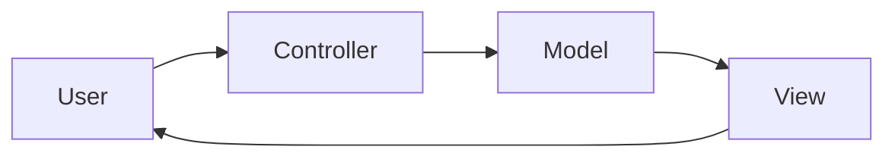
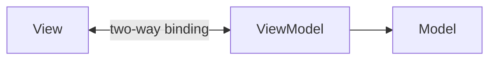
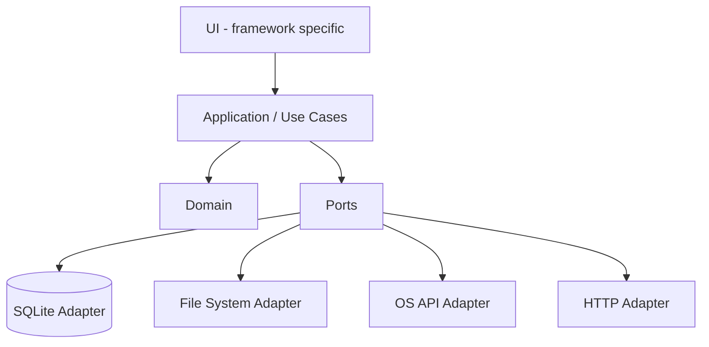
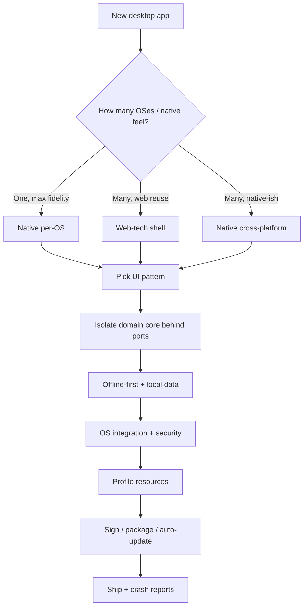

# Desktop Application Design & Architecture

Desktop applications differ from web/server applications because they **live on user-controlled machines**, run under the user's identity, integrate deeply with the operating system, handle local files and devices, are often used offline, are long-lived processes, and must distribute and update themselves. This increases both UX opportunity and security risk.

This file covers what makes desktop different, UI patterns, the native-vs-cross-platform decision, framework comparisons, per-OS specifics, process/threading, offline-first data, OS integration, security, performance, and packaging/updates. It builds on [`01`](01-architecture-principles.md)–[`03`](03-software-design-principles.md), [`06`](06-quality-attributes-tradeoffs.md), and [`07`](07-security-reliability-operations.md).

> **Desktop meta-principle:** *The user owns the machine.* Protect their data, be a courteous guest, respect platform conventions, and earn trust through signed, safely-updated, least-privilege software.

---

## 1. What Makes Desktop Different

| Dimension | Web/Server | Desktop |
|---|---|---|
| Execution environment | Your servers | User's machine (varied hardware/OS) |
| Trust | You control runtime | User controls runtime; can inspect/tamper |
| Connectivity | Assumed online | Often offline/intermittent |
| State | Centralized | Local, user-owned |
| Updates | Deploy server-side | Must ship and apply client updates |
| Resources | Provisioned | Shared with the user's other apps |
| Identity | App's service identity | The logged-in user's identity |
| Integration | Browser sandbox | Deep OS integration (FS, devices, shell) |
| Failure impact | Affects a request | Can lose the user's local work |
| Distribution | URL | Installers, stores, package managers |

#### Decision checklist
- Does it work offline? What happens to unsaved data on crash? Will old versions linger? Is it a good OS citizen? What privileges does it truly need?

---

## 2. Desktop UI Architecture Patterns

The MV* family (descendants of MVC and Fowler's *GUI Architectures*) separates presentation from logic in stateful, event-driven, long-lived UIs.

### 2.1 MVC (Model-View-Controller)

Smalltalk-80 origin. Controllers can bloat as logic accumulates.

### 2.2 MVP (Model-View-Presenter)
The View is **passive** (an interface); the Presenter holds presentation logic and updates the View. Works without data binding. Used by WinForms, classic Android, GWT.

### 2.3 MVVM (Model-View-ViewModel)

Two-way data binding, observable state, and commands. Used by WPF, WinUI, .NET MAUI, Avalonia, Uno, Qt/QML. Watch for "fat ViewModels" that accumulate domain logic.

### 2.4 MVU / The Elm Architecture (Unidirectional)
Immutable **Model → View → Messages → Update** loop. Predictable state, time-travel debugging. Used by Flutter (Bloc/Redux), SwiftUI, Jetpack Compose, Rust/Iced. Conceptually similar to web unidirectional stores ([04 §2.2](04-web-application-design.md#22-state-management)).

### 2.5 Choosing a UI Pattern
| Pattern | Best fit | Testability | Data binding |
|---|---|---|---|
| MVC | Simple/classic UIs | Moderate | No |
| MVP | No-binding toolkits | High (passive view) | No |
| MVVM | Binding-rich stacks (XAML/QML) | High | Yes |
| MVU | Reactive/declarative UIs | High (pure update) | Unidirectional |

Guidance: **let the toolkit lead** — fighting your framework's idiomatic pattern costs more than it saves.

---

## 3. Cross-Platform vs Native: The Core Decision

The most consequential desktop decision is native (per-OS) vs cross-platform, along a **fidelity ↔ portability** spectrum:

```
Highest fidelity ◄─────────────────────────────────► Highest reach
 Native per-OS    Native cross-platform toolkit      Web-tech shell
 (WinUI, AppKit,  (Qt, Flutter, MAUI, Avalonia,      (Tauri, Electron)
  GTK)             Uno)
```

| Approach | Fidelity | Effort for N platforms | Binary size | Performance | Web reuse |
|---|---|---|---|---|---|
| Native per-OS | Highest | High (N codebases) | Small | Highest | None |
| Native cross-platform | High | Medium (1 codebase) | Medium | High | Some |
| Web-tech shell | Varies | Low (1 codebase) | Large (Electron) / small (Tauri) | Good–moderate | Maximum |

- **Go native** for pro audio/video, CAD, games, performance-critical or flagship single-platform apps (e.g., a flagship macOS app).
- **Go cross-platform** for line-of-business apps, broad reach, and teams optimizing shared effort. (See build/buy and portability: [01 §9.4](01-architecture-principles.md#94-build-vs-buy-vs-open-source), [06 §2.9](06-quality-attributes-tradeoffs.md#2-the-quality-attributes-catalog).)

#### Decision checklist
- How many OSes must you support? How important is native fidelity/accessibility? What is the team's existing skill set? What performance and memory constraints exist? Can native integration be isolated behind a small surface?

---

## 4. Cross-Platform Frameworks Compared

*(Details evolve; trade-off profiles are stable. Verify current specifics against the framework docs in [`09`](09-references.md).)*

### 4.1 Electron (Chromium + Node.js)
A **main process** plus **renderer processes** communicating via IPC. Powers VS Code, Slack, Discord, Figma. Large binaries (often **~100–200 MB+**) and higher memory use. Security essentials: enable **context isolation**, disable **nodeIntegration** for remote content, strict **CSP**, expose only vetted APIs via **`contextBridge`** ([§9.2](#92-electron-specific-security)).

### 4.2 Tauri (System WebView + Rust)
Uses the OS webview (**WebView2 / WKWebView / WebKitGTK**) with a Rust backend; the frontend calls Rust via an `invoke` bridge. Very small binaries (a minimal app can be **< 600 KB**). Security model based on **capabilities, permissions, and scopes**; Rust core offers memory safety. Con: webview behavior varies by OS; v2 adds mobile support.

### 4.3 Qt (C++ / QML; PyQt/PySide)
**Qt Widgets** (classic desktop controls) vs **Qt Quick/QML** (GPU-accelerated, fluid UIs). Python bindings via PyQt/PySide. Mature, strong for industrial/embedded. Mind licensing (commercial vs LGPL/GPL).

### 4.4 Flutter Desktop (Dart, own rendering)
Google's toolkit draws its own widgets via **Skia/Impeller**, giving pixel-identical UI across desktop, mobile, and web, with hot reload. Less "native feel" by default since it doesn't use OS controls.

### 4.5 .NET MAUI / Avalonia / Uno (C#/.NET, XAML)
- **MAUI:** native controls per platform.
- **Avalonia:** Skia own-drawn, strong Linux support, WPF-like — good for cross-platform LOB and WPF migration.
- **Uno:** WinUI XAML everywhere, including WebAssembly.

### 4.6 Comparison Summary
| Framework | Language | UI model | Binary size | Native feel | Best for |
|---|---|---|---|---|---|
| Electron | JS/TS | Chromium webview | Large | Low–moderate | Web teams, rich UI, max ecosystem |
| Tauri | JS/TS + Rust | System webview | Small | Moderate | Lightweight web-tech apps, security focus |
| Qt | C++/QML (Py) | Widgets / Quick | Medium | High | Industrial, embedded, performance |
| Flutter | Dart | Own-drawn | Medium | Consistent (not native) | Multi-surface, custom design |
| MAUI/Avalonia/Uno | C#/.NET | XAML | Medium | High (MAUI) | .NET LOB, WPF/UWP migration |

> Recall the **First Law** ([06 §3](06-quality-attributes-tradeoffs.md#3-the-inevitability-of-trade-offs)): every framework trades fidelity, footprint, performance, and reuse differently. Choose by constraints, not fashion.

---

## 5. Per-OS Native Specifics

Respect each platform's conventions (Principle of Least Astonishment, [03 §2.10](03-software-design-principles.md#2-core-design-heuristics)). Desktop users expect apps to behave like other apps on their platform — native menus, shortcuts, dialogs, file pickers, notifications, window behavior, high-DPI/scaling, and dark/light/system themes.

### 5.1 Windows
- **Frameworks:** WinUI 3 / Windows App SDK, WPF, WinForms, UWP.
- **Storage:** `%APPDATA%`, `%LOCALAPPDATA%`, `%PROGRAMDATA%`; registry.
- **Integration:** Start Menu, taskbar, jump lists, toast notifications, system tray; Win32/COM/WinRT.
- **Packaging:** MSIX, MSI, Inno Setup, WiX, NSIS.
- **Security:** UAC; **Authenticode** code signing (EV cert → SmartScreen reputation); AppContainer.
- **Design:** Fluent.

### 5.2 macOS
- **Frameworks:** SwiftUI, AppKit; Catalyst.
- **Storage:** app bundle (`.app`); `~/Library/Application Support`, `/Preferences`, `/Caches`.
- **Integration:** global menu bar, Dock, Notification Center, Spotlight, Services, Handoff/Continuity.
- **Packaging:** `.dmg`/`.pkg`, Mac App Store.
- **Security:** **Developer ID signing + notarization (stapled)**, Hardened Runtime, Gatekeeper; **App Sandbox**, entitlements, TCC privacy permissions, Keychain.
- **Design:** Human Interface Guidelines (HIG).

### 5.3 Linux
- **Frameworks:** GTK (libadwaita), Qt (KDE); multiple desktop environments (GNOME/KDE/XFCE).
- **Storage:** **XDG Base Directory spec** (`$XDG_CONFIG_HOME`, `$XDG_DATA_HOME`, `$XDG_CACHE_HOME`).
- **Integration:** `.desktop` files, D-Bus, freedesktop notifications.
- **Packaging:** `.deb`, `.rpm`, Flatpak (Flathub), Snap, AppImage; mind **Wayland vs X11**.
- **Security:** portals, GPG-signed repos.
- **Design:** GNOME HIG / libadwaita; KDE HIG.

### 5.4 Per-OS Conventions Cheat Sheet
| Concern | Windows | macOS | Linux |
|---|---|---|---|
| Per-user data | `%APPDATA%` | `~/Library/Application Support` | `$XDG_DATA_HOME` |
| Cache | `%LOCALAPPDATA%` | `~/Library/Caches` | `$XDG_CACHE_HOME` |
| Menu location | In-window menu bar | Global menu bar | In-window (varies by DE) |
| Notifications | Toast | Notification Center | freedesktop/D-Bus |
| Packaging | MSIX/MSI | `.dmg`/`.pkg`/App Store | `.deb`/`.rpm`/Flatpak/Snap/AppImage |
| Signing | Authenticode | Developer ID + notarization | GPG/Flatpak |
| Tray | System tray | Menu bar extras | App indicator (DE-dependent) |

---

## 6. Application & Process Architecture

### 6.1 Layered Desktop Architecture
Keep a UI-framework-independent core behind ports (Hexagonal/Clean + DIP, [02 §3](02-architecture-patterns.md#3-layering--structural-patterns)):

This makes the domain testable and lets you swap UI toolkits or storage without rewriting business logic.

### 6.2 Threading & the UI Thread
**The UI is single-threaded.** Never block the UI thread; never touch UI objects from another thread. Marshal back to the UI thread with the platform mechanism: .NET `Dispatcher`/`BeginInvoke`, macOS main-thread dispatch, GTK `GLib.idle_add`, Qt signals/slots. Move any work that could exceed ~100 ms off the UI thread.

### 6.3 Single-Instance, Multi-Window & Lifecycle
Decide single-instance behavior (focus the existing window vs allow multiple); choose MDI/SDI/document-based window models; handle lifecycle events (launch, file-open, sleep/resume, logout/shutdown, quit-with-unsaved-changes).

### 6.4 Crash Resilience & State Persistence
**Autosave**, crash recovery, **atomic writes** (write to temp + rename), and crash reporting (minidumps **with consent**). Assume the process can die at any moment without losing the user's work.

---

## 7. Offline-First & Local Data

### 7.1 Offline-First Design
Treat the local machine as the **source of truth** and the network as an enhancement; sync when reconnected. Suits creative tools, notes, productivity, developer tools, data-entry, and field work. Avoid pure offline-first when data must always be centrally controlled and local copies are prohibited.

### 7.2 Local Storage Options
| Option | Best for |
|---|---|
| SQLite (embedded relational) | Structured local data, queries, transactions |
| Key-value / settings store | Preferences, small config |
| Files (JSON/binary) | Documents, exports |
| Embedded document/NoSQL | Flexible local objects |

Best practices: use OS-correct locations ([§5.4](#54-per-os-conventions-cheat-sheet)); use transactions; version and migrate schemas ([04 §9.3](04-web-application-design.md#93-database-migrations)); encrypt sensitive data at rest.

### 7.3 Sync & Conflict Resolution
Strategies, weakest → strongest: **last-write-wins (LWW)** (simple, lossy), **version vectors/timestamps**, **operational transforms / CRDTs** (automatic merge), **user-prompted** resolution. This is the eventual-consistency problem ([02 §6.6](02-architecture-patterns.md#66-consistency-models--cappacelc)) on the desktop. Make sync status visible; treat conflict resolution as a **product feature**, not an afterthought. Avoid silent LWW data loss.

---

## 8. OS Integration

Integration points: file system (native open/save dialogs, drag-and-drop, file associations, recent files), notifications, tray/menu-bar, global shortcuts, clipboard, auto-start, deep links / custom URL schemes, power/sleep events, hardware (camera/USB/printers), and shell context menus.

Best practices: use native dialogs; request capabilities lazily and with explanation; degrade gracefully when a capability is unavailable; clean up on uninstall; wrap each integration behind a **port** ([§6.1](#61-layered-desktop-architecture)) so the core stays portable.

---

## 9. Desktop Security

#### Threat model
The user controls the runtime and can inspect/tamper; secrets are stored locally where local attackers and malware are realistic threats; **auto-update is a prime attack vector**; OS sandboxing varies.

### 9.1 Core Desktop Security Practices
| Practice | Guidance |
|---|---|
| Least privilege | Don't require admin/sudo to run; request elevation only when essential |
| Code signing | Authenticode (Windows) / Developer ID + notarization (macOS) / GPG (Linux) |
| Secure auto-update | TLS + verify signature before applying ([07 §4/§8](07-security-reliability-operations.md#4-supply-chain-security)) |
| Secrets at rest | Windows DPAPI/Credential Manager, macOS Keychain, Linux Secret Service/keyring |
| Sandboxing | App Sandbox, MSIX/AppContainer, Flatpak/Snap portals |
| Input/IPC validation | Treat all renderer/IPC input as untrusted |
| Supply chain | Reproducible builds, dependency scanning, pinned versions |
| Sensitive data handling | Keep secrets out of logs, crash dumps, temp files |

### 9.2 Electron-Specific Security
Electron combines Chromium, Node.js, and native capabilities — that power must be constrained:

- Only load secure, trusted content; do **not** enable Node.js integration for remote content.
- Enable **context isolation** and **process sandboxing**.
- Define a restrictive **CSP**; don't disable web security or enable insecure content.
- Handle session permission requests explicitly; verify `<webview>` options.
- Disable/limit navigation and new-window creation; don't use `shell.openExternal` with untrusted content.
- Run a current Electron version; **validate the sender of every IPC message**; prefer custom protocols over `file://`; never expose raw Electron APIs to untrusted content (use `contextBridge`).

### 9.3 Tauri-Specific Security
Tauri separates a privileged **Rust core** from a webview frontend, controlled by **capabilities, permissions, and scopes** with IPC as the controlled bridge:

- Keep the exposed command surface small and typed; validate all command inputs.
- Use capabilities to define which windows/contexts can use which commands; restrict with scopes.
- Use CSP to constrain the frontend; remember the frontend is still a hostile boundary (XSS can still drive exposed commands).

### 9.4 Sandboxing & Permissions (Flatpak-informed)
- Prefer **portals** over broad filesystem access; use read-only access where possible.
- Avoid full home/host access and broad D-Bus access unless truly necessary.
- Request device access narrowly; use XDG base directories.
- Explain to users *why* a permission is needed.

> **Key reframe:** in web-tech shells, an XSS in the frontend can become **local code execution** with the user's privileges. Treat the web/IPC layer as a hostile boundary and apply secure-by-design ([04 §7.2](04-web-application-design.md#72-core-security-principles)).

---

## 10. Performance & Resource Use

Desktop apps share finite user hardware; users notice **startup time, memory footprint (idle and peak), CPU (especially idle), battery/energy, disk/install footprint, and responsiveness.**

| Area | Techniques |
|---|---|
| Startup | Lazy-load non-critical features; splash; measure cold vs warm |
| Memory | Fix handler/timer leaks; bound caches; watch long sessions |
| Idle CPU | Event-driven over polling; throttle when minimized |
| Battery | Reduce wakeups; respect power/thermal states |
| Responsiveness | Virtualize lists; debounce; async I/O |
| Footprint | Tree-shake; strip locales; Tauri vs Electron sizing |

Idle behavior matters as much as active behavior for an always-running app. Profile before optimizing ([03 §2.2](03-software-design-principles.md#22-kiss-keep-it-simple)); balance performance against maintainability/portability ([06 §2](06-quality-attributes-tradeoffs.md#2-the-quality-attributes-catalog)). Test on low-end machines.

---

## 11. Packaging, Distribution & Updates

### 11.1 Packaging & Installers
Produce per-OS artifacts ([§5.4](#54-per-os-conventions-cheat-sheet)); prefer **per-user** installs (no admin) where possible; ensure clean uninstall; use a consistent bundle/app ID.

### 11.2 Code Signing & Notarization
- **Windows:** Authenticode (standard vs EV; EV builds SmartScreen reputation faster).
- **macOS:** Developer ID + notarization + stapling + Hardened Runtime.
- **Linux:** GPG / Flatpak signing.

The signing key is the "crown jewel" — store it in an HSM or secure CI, never in the repo.

### 11.3 Auto-Update
Flow: check → download → **verify signature** → apply. Frameworks: Squirrel, Sparkle/WinSparkle, Tauri updater, MSIX/Store, Linux package managers. It is a prime attack vector and a way to brick apps — use staged rollouts, support rollback, verify signatures, and respect enterprise opt-out ([04 §7 A03/A08](04-web-application-design.md#71-owasp-top-10-2025)). Monitor update success and crash rates by version; test migration from old versions.

### 11.4 Distribution Channels
| Channel | Examples |
|---|---|
| App stores | Microsoft Store, Mac App Store, Flathub, Snap Store |
| Direct download | Signed installer from your site |
| Enterprise / managed | MSI + GPO, MDM, internal repos |
| Package managers | winget, Homebrew, apt/dnf, Flatpak |

---

## 12. Desktop-Specific Quality Attributes & Decision Workflow

Re-weighting the quality-attribute catalog ([06 §2](06-quality-attributes-tradeoffs.md#2-the-quality-attributes-catalog)) for desktop:

| Attribute | Desktop emphasis |
|---|---|
| Data safety / reliability | **Elevated** — local work must survive crashes |
| Resource efficiency | **Elevated** — shares the user's machine |
| Offline capability | **Elevated** — often the default mode |
| Updatability | **Elevated** — old clients linger in the wild |
| Native fidelity / usability | **Elevated** — users expect platform behavior |
| Security / local trust | **Reframed** — user owns runtime; update is an attack vector |
| Portability | The cross-platform axis ([§3](#3-cross-platform-vs-native-the-core-decision)) |
| Horizontal scalability | **De-emphasized** — single-user process |



---

## 13. Desktop Anti-Patterns

| Anti-pattern | Why harmful | Avoid by |
|---|---|---|
| Blocking the UI thread | Frozen, unresponsive app | Async + background workers (§6.2) |
| Requiring admin to run | Friction, security risk | Per-user install, least privilege (§9) |
| Storing data in install dir/Program Files | Breaks on update; needs admin | Use OS data dirs (§5.4) |
| No/unsigned auto-update | Users stuck on vulnerable versions; update hijacking | Signed, verified updates (§11.3) |
| Unsigned binaries | OS warnings; lost trust | Code sign + notarize (§11.2) |
| Plaintext secrets / own crypto | Local theft; broken crypto | OS keychain; vetted libraries (§9.1) |
| No autosave / non-atomic writes | Data loss on crash | Autosave + atomic writes (§6.4) |
| Greedy idle behavior | Battery/CPU drain | Event-driven; throttle when idle (§10) |
| Ignoring platform conventions | Confusing, untrusted | Follow per-OS HIG (§5) |
| Trusting the renderer (web-tech XSS) | Local code execution | Constrain IPC; validate input (§9.2–9.3) |
| Memory/handler leaks | Degrades over long sessions | Bound caches; remove handlers (§10) |
| Unwanted auto-start / tray squatting | User annoyance, distrust | Opt-in; respect user choice (§8) |

---

## Key Cross-References
- **Architecture & design:** [`01`](01-architecture-principles.md), [`02`](02-architecture-patterns.md), [`03`](03-software-design-principles.md).
- **Quality attributes & trade-offs:** [`06`](06-quality-attributes-tradeoffs.md).
- **Security, updates, telemetry:** [`07`](07-security-reliability-operations.md). **Checklists:** [`08` §8](08-checklists-and-templates.md#8-desktop-application-checklist).
