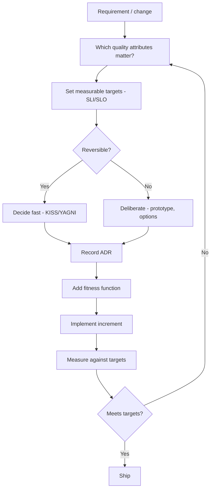

# Cross-Cutting Quality Attributes & Trade-offs

This file is about deciding **what matters** and resolving the inevitable tensions between competing goals. It covers the catalog of non-functional requirements (quality attributes, the "-ilities"), the trade-off theorems and models that govern distributed systems, the Well-Architected pillars, architecture evaluation methods, decision frameworks, and the essential-vs-accidental complexity lens — ending with a practical decision workflow.

It is the conceptual hub for [`01`](01-architecture-principles.md)–[`05`](05-desktop-application-design.md) and [`07`](07-security-reliability-operations.md).

> *There is no "best architecture" — only the best set of trade-offs for **your** context.*

---

## 1. What Are Quality Attributes (NFRs)?

Quality attributes (a.k.a. non-functional requirements, NFRs, or "-ilities") describe **how well** a system does what it does, and under which constraints — as opposed to functional requirements (*what* it does). They are what actually drive architectural decisions; systems fail when quality attributes are left implicit.

**Four key truths:**
1. You **cannot maximize all** of them — improving one often costs another.
2. They must be **measurable** — e.g., "p99 latency < 200 ms at 10k RPS," not "fast."
3. They **derive from business needs** — copy targets from your own context, not another company's.
4. They are **testable** — guard them with fitness functions ([01 §9.3](01-architecture-principles.md#93-architectural-fitness-functions)).

---

## 2. The Quality Attributes Catalog

Each attribute: *definition → how to measure → tactics → what it trades against.*

| Attribute | Key question | Typical measures |
|---|---|---|
| **Performance** | Fast enough? | Latency (p50/p95/p99), throughput (RPS/TPS), resource use |
| **Scalability** | Grows with demand? | Max throughput, horizontal scaling factor |
| **Availability** | Stays up under failure? | Uptime "nines," MTBF/MTTR, error budget |
| **Reliability** | Correct over time? | Error rate, fault tolerance, recovery time |
| **Security** | Resists misuse/attack? | Vulnerabilities, control coverage, exploitability |
| **Maintainability** | Safe to change? | Lead time, change failure rate, coupling, complexity |
| **Testability** | Easy to verify? | Coverage of intent, test speed, isolation |
| **Operability** | Observe/deploy/recover? | MTTR, alert quality, runbook completeness |
| **Observability** | Diagnose from outputs? | MTTD/MTTR, RED/USE coverage, trace propagation |
| **Portability** | Move across platforms? | Vendor/platform coupling, abstraction layers |
| **Usability** | Users succeed? | Task success, time on task, SUS score, support tickets |
| **Accessibility** | Usable by people with disabilities? | WCAG conformance, keyboard/screen-reader support |
| **Privacy** | Personal data minimized/protected? | Data inventory, retention, consent, access controls |
| **Cost** | Value justifies spend? | Unit cost, cloud spend, support cost |
| **Sustainability** | Minimizes resource waste? | Energy use, idle resources, data volume |
| **Interoperability** | Works with other systems? | Open standards, versioned APIs, ACLs |
| **Safety** | Prevents harm to people, data, or property under fault conditions? | Hazard coverage, fail-safe behavior, incident severity |

#### Standards mapping: ISO/IEC 25010:2023

This catalog is a practitioner-oriented restatement of the international **product quality model**, **ISO/IEC 25010:2023** (part of the SQuaRE series), which groups quality into **9 characteristics** (each with sub-characteristics). The table below maps this guide's "-ilities" onto the standard's characteristics — use it to translate between this guide's vocabulary and an auditor's or RFP's:

| ISO/IEC 25010:2023 characteristic | Sub-characteristics (examples) | Corresponding attribute(s) above |
|---|---|---|
| **Functional Suitability** | Completeness, correctness, appropriateness | (functional requirements — out of scope for this NFR catalog) |
| **Performance Efficiency** | Time behavior, resource utilization, capacity | Performance, Scalability |
| **Compatibility** | Co-existence, interoperability | Interoperability, Portability |
| **Interaction Capability** *(renamed from Usability)* | Appropriateness recognizability, learnability, accessibility, user error protection | Usability, Accessibility |
| **Reliability** | Maturity, availability, fault tolerance, recoverability | Reliability, Availability |
| **Security** | Confidentiality, integrity, non-repudiation, accountability, authenticity | Security, Privacy (partial) |
| **Maintainability** | Modularity, reusability, analyzability, modifiability, testability | Maintainability, Testability |
| **Flexibility** *(renamed from Portability)* | Adaptability, installability, replaceability, scalability | Portability |
| **Safety** *(new in 2023)* | Operational constraint, risk identification, fail-safe, hazard warning, safe integration | Safety (added above) |

**Safety** is the newest characteristic (added in the 2023 revision) and was previously absent from this guide's catalog. It covers preventing or limiting harm to people, property, or the environment from a system's operation or malfunction — not the same as *Security* (which resists intentional misuse). Most business/consumer software has light Safety requirements (e.g., "don't corrupt the user's data," "fail closed on a permission check"); systems with **physical, financial, or life-safety consequences** (medical devices, automotive, industrial control, aviation, financial trading) should consult **domain-specific functional-safety standards** — **IEC 61508** (generic), **ISO 26262** (automotive), **DO-178C** (avionics software), **IEC 62304** (medical device software) — which go well beyond this technology-agnostic guide's scope.

Related standards worth knowing: **ISO/IEC 25012** defines a parallel **data quality model** (15 characteristics — accuracy, completeness, consistency, currentness, etc.), relevant wherever this guide discusses data ownership ([01 §8](01-architecture-principles.md#8-treat-data-ownership-as-an-architectural-decision)); **ISO/IEC 25023** defines *measures* for each 25010 characteristic (how to turn "maintainability" into a number); **ISO/IEC 25040** defines the quality *evaluation process*. See the full crosswalk in [`13`](13-standards-crosswalk.md#1-quality-models--measurement-square-series).

### Notable tactics & details

- **2.1 Performance** — caching, async/parallelism, CDN/edge, connection pooling, denormalization. *Measure first; optimize hotspots only.*
- **2.2 Scalability** — vertical vs horizontal; statelessness, sharding/partitioning, CQRS. Trades against consistency, simplicity, cost, latency.
- **2.3 Availability** — the "nines":

  | Availability | Downtime/year |
  |---|---|
  | 99% | ~3.65 days |
  | 99.9% ("three nines") | ~8.76 hours |
  | 99.99% ("four nines") | ~52.6 minutes |
  | 99.999% ("five nines") | ~5.26 minutes |

  *100% is the wrong target* — use **error budgets** and SLOs ([07 §5](07-security-reliability-operations.md#5-slos-slis-and-error-budgets)).
- **2.4 Reliability** — retries with backoff + idempotency, circuit breakers, chaos engineering.
- **2.5 Security** — the CIA triad (Confidentiality, Integrity, Availability); defense in depth, least privilege, zero trust, encryption in transit and at rest ([04 §7](04-web-application-design.md#7-web-application-security)).
- **2.6 Maintainability** — *"High internal quality makes future change faster, not slower"* (Fowler). Watch coupling/cohesion, complexity, change failure rate.
- **2.7 Testability** — DI, pure functions, hexagonal/clean architecture ([03 §9](03-software-design-principles.md#9-testing-principles)).
- **2.8 Observability** — logs/metrics/traces, MTTD/MTTR, RED/USE, OpenTelemetry, correlation IDs ([04 §13](04-web-application-design.md#13-observability)).
- **2.9 Portability** — containerization, 12-Factor, abstraction layers; trades against convenience and lock-in ([01 §9.4–9.5](01-architecture-principles.md#94-build-vs-buy-vs-open-source)).
- **2.10 Usability** — task success, time-on-task, the System Usability Scale (SUS), accessibility, POLA, progressive disclosure.
- **2.11 Cost** — TCO, cost-per-transaction; right-sizing, autoscaling, serverless for spiky loads, buy-vs-build ([07 §14](07-security-reliability-operations.md#14-cost-optimization)).
- **2.12 Interoperability** — open standards, versioned APIs, anti-corruption layers.
- **2.13 Safety** — fail-safe defaults (deny/closed on ambiguous state), hazard identification during design review, explicit operational constraints, clear hazard warnings to users/operators, safe integration with adjacent systems. Trades against availability (a fail-safe often means fail-*stopped*) and usability (safety interlocks add friction). See the ISO/IEC 25010 mapping above; domain-specific functional-safety standards apply where harm consequences are physical or life-safety.

#### Implementation guidance
Convert vague qualities into **measurable scenarios**: *"At p95, checkout API latency must be under 300 ms for 1,000 concurrent users."* Define minimum-acceptable and stretch targets; record rationale in ADRs; automate checks where feasible.

---

## 3. The Inevitability of Trade-offs

Quality attributes form a web of tensions; the architect's job is to find the **least-worst set of trade-offs** for the context.

- **First Law of Software Architecture** (Ford/Richards): *"Everything in software architecture is a trade-off."*
- **Second Law:** *"Why is more important than how"* — capture rationale in ADRs.

| Tension | Governed by |
|---|---|
| Consistency ↔ Availability | CAP |
| Consistency ↔ Latency | PACELC |
| Performance ↔ Maintainability | — |
| Security ↔ Usability | — |
| Scalability ↔ Simplicity | — |
| Flexibility ↔ Simplicity | — |
| Time-to-market ↔ Quality | — |
| Portability ↔ Convenience | — |
| Cost ↔ Reliability | — |
| Decoupling ↔ Visibility | — |

#### Decision checklist (for any trade-off)
- What are we optimizing for, and what are we sacrificing?
- What failure mode are we accepting?
- How reversible is this?
- How will we know if it was wrong?

---

## 4. Key Trade-off Theorems & Models

### 4.1 CAP Theorem
Under a network **Partition**, a distributed system can guarantee **Consistency** *or* **Availability**, not both. You don't *choose* P — partitions happen — so the real choice is **CP** (refuse/await to stay consistent) vs **AP** (serve possibly-stale data to stay available).
- **CP example:** bank balance, inventory decrement.
- **AP example:** social likes/counters, feeds.

### 4.2 PACELC
Extends CAP: *if* **P**artition → choose **A** or **C**; **E**lse (normal operation) → choose **L**atency or **C**onsistency. It captures that strong consistency costs latency *even without* failures.

#### Decision checklist
- Does this data need to be correct *now*, or is slightly stale acceptable?
- What is the user/business impact of stale data vs unavailability vs added latency?

### 4.3 The Fallacies of Distributed Computing
Eight false assumptions (Deutsch/Gosling) that cause distributed-system failures:
1. The network is reliable.
2. Latency is zero.
3. Bandwidth is infinite.
4. The network is secure.
5. Topology doesn't change.
6. There is one administrator.
7. Transport cost is zero.
8. The network is homogeneous.

Every one motivates a resilience pattern ([02 §7](02-architecture-patterns.md#7-distributed-systems-resilience-patterns)).

### 4.4 Amdahl's Law & the Universal Scalability Law
- **Amdahl's Law:** the serial fraction of a workload bounds the maximum speedup from parallelism.
- **Universal Scalability Law (Gunther):** adds a **coherence/coordination** penalty — beyond a point, adding nodes *reduces* throughput. Motivates minimizing coordination ([02 §7.8](02-architecture-patterns.md#78-minimize-coordination)).

### 4.5 Conway's Law (as a constraint)
Team and communication structure constrains the architecture you can realistically build and operate; use the **Inverse Conway Maneuver** deliberately ([01 §2.7](01-architecture-principles.md#27-conways-law--team-structure)).

---

## 5. Well-Architected Pillars

A vendor-neutral synthesis of the AWS, Azure, and Google Cloud Well-Architected frameworks.

| Pillar | Question | Key practices |
|---|---|---|
| **Operational Excellence** | Can we run and improve it? | IaC, automation, runbooks, observability, learning from failure |
| **Security** | Is it protected? | Least privilege, defense in depth, encryption, identity, auditing |
| **Reliability** | Does it recover? | Redundancy, failover, backups, SLOs, tested DR |
| **Performance Efficiency** | Does it use resources well? | Right-sizing, caching, appropriate tech, measurement |
| **Cost Optimization** | Is spend justified? | Right-sizing, autoscaling, removing waste, unit economics |
| **Sustainability** | Does it minimize impact? | Efficient resources, retention discipline, fewer idle resources |

Use the pillars as a structured review lens; the [Architecture Review Checklist](08-checklists-and-templates.md#2-architecture-review-checklist) operationalizes them.

---

## 6. Architecture Evaluation Methods

### 6.1 ATAM (Architecture Tradeoff Analysis Method)
The SEI method for evaluating an architecture against quality goals via **quality-attribute scenarios**, identifying **trade-off points**, **sensitivity points**, **risks**, and **non-risks**. Example scenario: *"Under 10× load, p99 stays under 500 ms."* Thorough but heavyweight — best for high-stakes systems.

**Standards counterpart:** **ISO/IEC 25040** defines a formal SQuaRE *quality evaluation process* (establish requirements → specify evaluation → design evaluation → execute → conclude) that plays a similar role to ATAM in a standards-driven or audited context; **ISO/IEC/IEEE 42010**'s stakeholder/concern/viewpoint model ([01 §9.2](01-architecture-principles.md#92-the-c4-model)) provides the vocabulary for documenting what an ATAM or 25040 evaluation examined. Treat these as complementary formal frameworks, not replacements for the lighter-weight methods below.

### 6.2 Lightweight Alternatives
- Quality-attribute scenarios + **fitness functions** ([01 §9.3](01-architecture-principles.md#93-architectural-fitness-functions)).
- **Risk-storming** / threat modeling ([07 §2](07-security-reliability-operations.md#2-threat-modeling)).
- **ADRs** ([01 §9.1](01-architecture-principles.md#91-architecture-decision-records-adrs)).
- **Pre-mortems** ("imagine it failed — why?").

---

## 7. Decision-Making Frameworks

### 7.1 A Trade-off-Driven Decision Process
1. Identify the **driving** quality attributes.
2. Turn them into **measurable targets** (SLI/SLO).
3. Enumerate options.
4. Map each option to the qualities (who wins, who loses).
5. Assess **reversibility** (one-way vs two-way door, [01 §1.2](01-architecture-principles.md#12-architecturally-significant-decisions--reversibility)).
6. Choose the **least-worst** set of trade-offs.
7. Record an **ADR**.
8. Add a **fitness function** to guard it.
9. **Revisit** when assumptions change.

### 7.2 Heuristics & Razors
| Heuristic | Meaning |
|---|---|
| **YAGNI** | Don't build it until you need it |
| **KISS** | Prefer the simplest thing that works |
| **Last Responsible Moment** | Defer irreversible decisions until you must decide |
| **MonolithFirst** | Start monolithic; extract services when justified |
| **Boring Technology** | Spend limited "innovation tokens" wisely |
| **Build what differentiates** | Buy/adopt the commodity rest |
| **Make it work, right, fast** | In that order |
| **Worse is Better** | Simplicity of implementation can beat completeness |
| **Principle of Least Power** | Use the least powerful tool that solves the problem |

### 7.3 When to Choose Simpler vs More Complex
**Favor simpler** when: requirements are uncertain, the team is small, time-to-market dominates, the domain is new, or the decision is reversible.
**Invest in more complex/robust** when: hard requirements demand it (compliance, high availability, independent scaling), the cost of retrofitting is high, or the failure cost is severe. This synthesizes YAGNI with "build for the needs of the business" ([01 §9.6](01-architecture-principles.md#96-build-for-the-needs-of-the-business)).

---

## 8. Essential vs Accidental Complexity

Fred Brooks's *No Silver Bullet* distinction:
- **Essential complexity** is inherent in the problem (a tax system *is* complicated) and cannot be removed.
- **Accidental complexity** is self-inflicted by our tools, designs, and choices — and *can* be reduced.

The architect's leverage is to **attack accidental complexity** (poor abstractions, incidental coupling, unnecessary distribution) while accepting and managing the essential. KISS targets the accidental ([03 §2.2](03-software-design-principles.md#22-kiss-keep-it-simple)).

#### Decision checklist
- Is this complexity essential to the problem, or accidental to our solution?
- Can we remove it without losing a required capability?
- Are we adding distribution/abstraction that the problem doesn't demand?

---

## 9. A Practical Decision Workflow

**Synthesis in one paragraph:** Decide *what matters* from business needs, make it measurable, calibrate rigor to reversibility, choose the least-worst trade-offs, record the *why*, guard it with fitness functions, and revisit as you learn. Manage complexity, make change cheap, expect failure, and align with the business.

---

## Key Cross-References
- **Principles & patterns:** [`01`](01-architecture-principles.md), [`02`](02-architecture-patterns.md). **Code:** [`03`](03-software-design-principles.md).
- **Surfaces:** [`04`](04-web-application-design.md), [`05`](05-desktop-application-design.md), [`12`](12-mobile-application-design.md).
- **Operating it:** [`07`](07-security-reliability-operations.md). **Templates:** [`08`](08-checklists-and-templates.md).
- **Standards crosswalk (ISO/IEC 25010/25012/25040/5055):** [`13`](13-standards-crosswalk.md).
